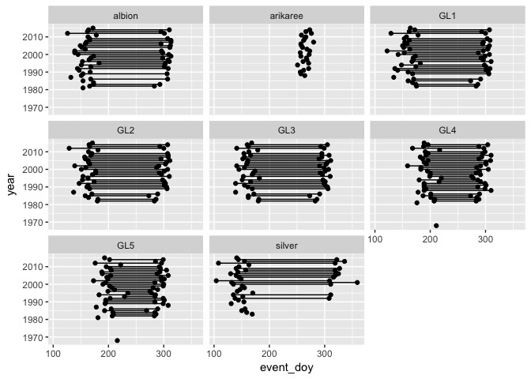
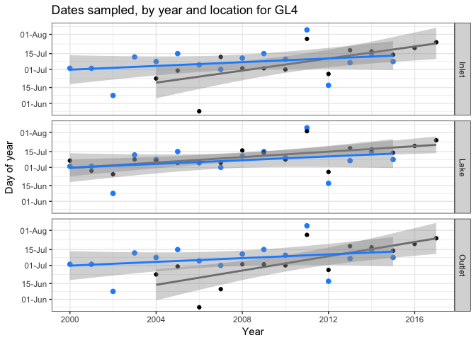

Water quality and chemistry data munging for Green Lake 4
================
CTW
2018-03-12

Script purpose
--------------

NWT LTER has a decades-long record of data collected annually or nearly so for lakes and streams in the Green Lakes Valley. A challenge in working with such a wealth of data is how to make sense of so much data: how to summarize? at what scale or frequency? what to summarize? what descriptive summary statistics to calculate (e.g. mean, max, min, metrics of variance)? and what should be related to what? This script is a first attempt in wrangling one NWT LTER's long term "core" datasets (actually two related datasets): water quality and water chemistry from Green Lakes Valley. A long-term data goal for NWT LTER is to make its data more accessible and intelligible to researchers and the public, to promote visibility of NWT LTER itself, the long-history of research conducted there and the core datasets in particular, as well as spur novel uses of the core datasets. A strategy for achieving this goal is to automate simple dataset clean up, any preparation (transformation) needed for summarizing, and data visualization.

As such, the purposes of this script are to:

-   Read in relevant datasets directly from the NWT LTER website (these are more up to date than what's on the EDI data portal):
    -   Green Lake 4 water chemistry (PI: Nel Caine)
    -   Green Lake Valley water chemistry (PI: Diane McKnight)
    -   Green Lake Valley water quality (PI: Diane McKnight)
-   Visually assess each dataset for metrics included, temporal and spatial range, and sampling frequency within those ranges
-   Asses which metrics and sites overlap between disparate datasets
-   Focus on Green Lake 4 and combine water chemistry and water quality datasets to create master long-term aquatic ecology dataset for GL4
-   Test data summarizing and visualization (this will be a work in progress as CTW received feedback)

I focus on Green Lake 4 because that is a site with greatest consistentcy of sampling through time (per Kelly Loria, and it shows in the data). I have some exposure to NWT LTER from past field work and data tasks, and I have academic training and work experience in freshwater ecology, however I do not conduct research at NWT nor work in aquatic ecosystems currently. My experience going through these data and challenges incurred should be fairly representative of an outside researcher or someone with ecological knowledge interested in aquatic data (e.g. environmental science for the City of Boulder) curious about NWT data.

For comments or collaborations, email <caitlin.t.white@colorado.edu>, login to GitHub to add issues or items to the project board for this repository, or fork the repository to edit code, and submit pull requests.

Setup
-----

``` r
# Load needed libraries
library(tidyverse)
library(lubridate)
```

``` r
# Read in water quality and water chemistry datasets on GL4

# --NA codes--
# u=Undetected
# DNS=Data Not Submitted
# EQCL=Exceeds Quality Control Limits
# N/A=Not Applicable
# NP=Not Performed
# NSS=No Sample Submitted
# NV=Not Valid
# QNS=Quantity Not Sufficient
# NA=Not available
```

``` r
# Nel Caine water chemistry dataset,  through 2014
Caine_GL4_waterchem <- read_csv("http://niwot.colorado.edu/data_csvs/gre4solu.nc.data.csv",
                          na = c("NaN", "DNS",  "EQCL", "N/A", "NP", "NSS", "NV", "u", "QNS", NA, " ", ""))

# Diane McKnight water chemistry dataset, through 2016
# issues: year is wrong (has 1905 for 2014 and 2015 dates), TDP, IP and PO4 has "<" attached to some values
McKnight_GLV_waterchem <- read_csv("http://niwot.colorado.edu/data_csvs/glvwatsolu.dm.data.csv",
                               na = c("NaN", "DNS",  "EQCL", "N/A", "NP", "NSS", "NV", "u", "QNS", NA, " ", ""))

# Diane McKnight water quality dataset
McKnight_GLV_WQdat <- read_csv("http://niwot.colorado.edu/data_csvs/water_quality_GLV.dm.data.csv", 
                      trim_ws = TRUE,
                      na = c("NaN", NA, "NA ", " ", ""))

McKnight_GL4_WQdat <- McKnight_GLV_WQdat[McKnight_GLV_WQdat$local_site=="GL4",]

# read in Nel Caine ice on and ice off dates
# raw data are days counted from September 30 (Sept 30 = 1)
GLV_iceon <- read_csv("~/Dropbox/NWT_data/GLV_iceon_NelCaine.csv",
                      skip = 3,
                      col_names = c("year", "silver", "albion", "GL1", "GL2", "GL3", "GL4", "GL5", "arikaree"))

# raw data are days counted from May 1 (May 1 = 1)
GLV_iceoff <- read_csv("~/Dropbox/NWT_data/GLV_iceoff_NelCaine.csv",
                      skip = 3,
                      col_names = c("year", "silver", "albion", "GL1", "GL2", "GL3", "GL4", "GL5"))
```

``` r
# Clean up and prep data

# ice phenology datasets
iceon <- GLV_iceon %>%
  gather(site, d_from_ref, silver:arikaree) %>%
  mutate(refdate = as.Date(paste(year, "09/30",sep="/")),
         event_date = refdate + d_from_ref,
         event_doy = yday(event_date),
         event = "iceon")

# ice phenology datasets
iceoff <- GLV_iceoff %>%
  gather(site, d_from_ref, silver:GL5) %>%
  mutate(refdate = as.Date(paste(year, "04/30",sep="/")),
         event_date = refdate + d_from_ref,
         event_doy = yday(event_date),
         event = "iceoff")

# put it together!
ice_phenology <- rbind(iceoff, iceon)

ggplot(ice_phenology, aes(event_doy, year)) + geom_point() + geom_path(aes(group=year)) + facet_wrap(~site)
```

    ## Warning: Removed 81 rows containing missing values (geom_point).

    ## Warning: Removed 29 rows containing missing values (geom_path).

    ## geom_path: Each group consists of only one observation. Do you need to
    ## adjust the group aesthetic?



``` r
# Caine waterchem dataset --
Caine_GL4 <- dplyr::select(Caine_GL4_waterchem, -contains("sdev")) %>%
  subset(samp_loc == "GREEN LAKE 4") %>%
  gather(metric, value, pH:POC) %>%
  mutate(value = as.numeric(value)) %>%
  filter(!is.na(value))
```

    ## Warning in eval(substitute(expr), envir, enclos): NAs introduced by
    ## coercion

``` r
Caine_sdev <- dplyr::select(Caine_GL4_waterchem, samp_loc:time, contains("sdev")) %>%
  subset(samp_loc == "GREEN LAKE 4") %>%
  gather(sdev, sd_value, d18O_sdev:T_sdev) %>%
  mutate(metric = gsub("_sdev", "", sdev)) %>%
  filter(!is.na(sd_value))
Caine_sdev$metric <- gsub("dD", "dDeut", Caine_sdev$metric)
Caine_sdev$metric <- gsub("T", "Trit", Caine_sdev$metric)

Caine_long <- left_join(Caine_GL4, Caine_sdev) %>%
  mutate(doy = yday(date),
         # metatadata says June-Oct (summer conditions) samples taken from outlet, Nov-May under ice from lake
         location = ifelse(month(date) %in% 6:10, "Outlet", "Lake"),
         depth = ifelse(month(date) %in% 6:10, NA, 0),
         source = "Caine") %>%
  dplyr::select(-samp_loc)
```

    ## Joining, by = c("samp_loc", "year", "date", "time", "metric")

``` r
# plot data availability
Caine_long %>%
  #filter(location != "Lake") %>%
  group_by(year, location, metric) %>%
  summarise(nobs = length(metric)) %>%
  ggplot() +
  geom_col(aes(year, nobs, fill=location), width=0.7) +
  scale_fill_brewer(palette = "Paired") +
  scale_x_continuous(breaks=seq(1980, 2015, 5)) +
  theme_bw() +
  theme(axis.text.x = element_text(angle = 90)) +
  facet_wrap(~metric)
```


``` r
# McKnight dataset --
# fix year
McKnight_GLV_waterchem$year <- year(McKnight_GLV_waterchem$date)
# remove any values with "<" since not sure of value in context of other values
## TDP
summary(with(McKnight_GLV_waterchem, grepl("<", TDP))) # 13 observations true
```

    ##    Mode   FALSE    TRUE    NA's 
    ## logical     908      13       0

``` r
McKnight_GLV_waterchem$TDP <- as.numeric(with(McKnight_GLV_waterchem, ifelse(grepl("<", TDP), NA, TDP))) 
## IP
summary(with(McKnight_GLV_waterchem, grepl("<", IP))) # 19 observations true
```

    ##    Mode   FALSE    TRUE    NA's 
    ## logical     902      19       0

``` r
McKnight_GLV_waterchem$IP <- as.numeric(with(McKnight_GLV_waterchem, ifelse(grepl("<", IP), NA, IP)))
## PO4
summary(grepl("<", McKnight_GLV_waterchem$'PO4---')) # 19 observations true
```

    ##    Mode   FALSE    TRUE    NA's 
    ## logical     902      19       0

``` r
McKnight_GLV_waterchem$'PO4---' <- as.numeric(ifelse(grepl("<", McKnight_GLV_waterchem$`PO4---`), NA, McKnight_GLV_waterchem$'PO4---')) 

McKnight_GL4 <- dplyr::select(McKnight_GLV_waterchem, -contains("sdev")) %>%
  subset(local_site == "GL4") %>%
  gather(metric, value, pH:POC) %>%
  mutate(value = as.numeric(value)) %>%
  filter(!is.na(value))
```

    ## Warning in eval(substitute(expr), envir, enclos): NAs introduced by
    ## coercion

``` r
McKnight_sdev <- dplyr::select(McKnight_GLV_waterchem, LTER_site:`depth/loc`, contains("sdev")) %>%
  subset(local_site == "GL4") %>%
  gather(sdev, sd_value, d18O_sdev:T_sdev) %>%
  mutate(metric = gsub("_sdev", "", sdev)) %>%
  filter(!is.na(sd_value))
McKnight_sdev$metric <- gsub("dD", "dDeut", McKnight_sdev$metric)
McKnight_sdev$metric <- gsub("T", "Trit", McKnight_sdev$metric)

McKnight_long <- left_join(McKnight_GL4, McKnight_sdev) %>%
  mutate(doy = yday(date)) %>%
  dplyr::select(-LTER_site, -local_site, -comments) %>%
  # keep only these sample depths/locations for now
  filter(`depth/loc` %in% c("0m", "3m", "6m", "9m", "Surface", "Inlet", "Outlet")) %>%
  # split depth from location, and make depth numeric
  mutate(`depth/loc` = gsub("Surface", "0m", `depth/loc`),
         location = ifelse(grepl("m",`depth/loc`), "Lake",
                           ifelse(`depth/loc` == "Inlet", "Inlet", "Outlet")),
         depth = ifelse(location == "Lake", parse_number(`depth/loc`), NA),
         source = "McKnight") %>%
  dplyr::select(-`depth/loc`)
```

    ## Joining, by = c("LTER_site", "local_site", "year", "date", "time", "depth/loc", "metric")

    ## Warning: 6406 parsing failures.
    ## row # A tibble: 5 x 4 col     row   col expected actual expected   <int> <int>    <chr>  <chr> actual 1    19    NA a number Outlet row 2    20    NA a number Outlet col 3    21    NA a number Outlet expected 4    36    NA a number  Inlet actual 5    37    NA a number Outlet
    ## ... ................. ... ............................. ........ ............................. ...... ............................. ... ............................. ... ............................. ........ ............................. ...... .............................
    ## See problems(...) for more details.

``` r
McKnight_long_alldepths <- left_join(McKnight_GL4, McKnight_sdev) %>%
  mutate(doy = yday(date)) %>%
  dplyr::select(-LTER_site, -local_site, -comments) %>%
  # keep only these sample depths/locations for now
  filter(grepl("m|Surface|Inlet|Outlet|waterfall", `depth/loc`)) %>%
  # split depth from location, and make depth numeric
  mutate(`depth/loc` = gsub("Surface", "0m", `depth/loc`),
         location = ifelse(grepl("m",`depth/loc`), "Lake",
                           ifelse(`depth/loc` == "Inlet", "Inlet", 
                                  ifelse(`depth/loc` == "Outlet", "Outlet", "Waterfall"))),
         depth = ifelse(location == "Lake", parse_number(`depth/loc`), NA),
         source = "McKnight") %>%
  dplyr::select(-`depth/loc`)
```

    ## Joining, by = c("LTER_site", "local_site", "year", "date", "time", "depth/loc", "metric")

    ## Warning: 6569 parsing failures.
    ## row # A tibble: 5 x 4 col     row   col expected actual expected   <int> <int>    <chr>  <chr> actual 1    21    NA a number Outlet row 2    22    NA a number Outlet col 3    23    NA a number Outlet expected 4    39    NA a number  Inlet actual 5    40    NA a number Outlet
    ## ... ................. ... ............................. ........ ............................. ...... ............................. ... ............................. ... ............................. ........ ............................. ...... .............................
    ## See problems(...) for more details.

``` r
# join both water chemistry datasets
GL4_waterchem <- rbind(Caine_long, McKnight_long)

# plot data availability Jun - Sep
# what is sampling frequency by depth over time?
# lake only
GL4_waterchem %>%
  filter(month(date) %in% 6:9, 
         location == "Lake") %>%
  group_by(year, location, depth, metric) %>%
  summarise(nobs = length(metric)) %>%
  ggplot() +
  geom_vline(aes(xintercept=0), col="dodgerblue4", lwd=1) +
  geom_point(aes(depth, year, group=depth,  col=nobs, size=nobs), alpha=0.4) +
  scale_color_distiller(palette = "Set2") +
  scale_size_continuous() +
  scale_x_reverse(breaks=seq(0, 9, 3)) +
  #scale_y_continuous(breaks=seq(1980, 2015, 5)) +
  theme_bw() +
  theme(axis.text.x = element_text(angle = 90)) +
  coord_flip() +
  facet_wrap(~metric)
```


``` r
# what is sampling frequency by depth over time?
# lake only
McKnight_long_alldepths %>%
  filter(month(date) %in% 6:9, 
         location == "Lake") %>%
  group_by(year, location, depth, metric) %>%
  summarise(nobs = length(metric)) %>%
  ggplot() +
  geom_vline(aes(xintercept=0), col="dodgerblue4", lwd=1) +
  geom_point(aes(depth, year, group=depth,  col=nobs, size=nobs), alpha=0.4) +
  scale_color_distiller(palette = "Set2",breaks=seq(0,12,3)) +
  scale_size_continuous(breaks=seq(0,12,3)) +
  scale_x_reverse(expand = c(0.1,0), breaks=seq(0, 10, 2)) +
  #scale_y_continuous(breaks=seq(1980, 2015, 5)) +
  theme_minimal() +
  theme(axis.text.x = element_text(angle = 90)) +
  coord_flip() +
  facet_wrap(~metric)
```


``` r
# inlet and outlet only
GL4_waterchem %>%
  filter(month(date) %in% 6:9, 
         location != "Lake") %>%
  group_by(source, year, location, depth, metric) %>%
  summarise(nobs = length(metric)) %>%
  mutate(grouping = paste(source, location, sep="_")) %>%
  ggplot() +
  geom_col(aes(year, nobs, fill=grouping), width=0.7) +
  scale_fill_brewer(palette = "Paired") +
  scale_x_continuous(breaks=seq(1980, 2015, 5)) +
  theme_bw() +
  theme(axis.text.x = element_text(angle = 90)) +
  facet_wrap(~metric)
```


``` r
# Compare outlet values by source
ggplot(subset(GL4_waterchem, location == "Outlet")) +
  geom_point(aes(date, value, col=source), alpha=0.5) +
  labs(x="Date", y ="Value", title = "GL4 water chemistry samples from outlet") +
  theme_light() +
  facet_wrap(~metric, scales = "free_y")
```


``` r
ggplot(subset(GL4_waterchem, location == "Lake" & depth == 0)) +
  geom_point(aes(date, value, col=source), alpha=0.5) +
  labs(x="Date", y ="Value", title = "GL4 water chemistry samples from lake surface") +
  theme_light() +
  facet_wrap(~metric, scales = "free_y")
```


``` r
# What is temporal frequency of data by measurement and site?
ggplot(GL4_waterchem, aes(date, value, col=source)) + 
         geom_point(alpha=0.3) +
  #geom_errorbar(aes(ymin = value - sd_value, ymax = value + sd_value), alpha=0.3) +
  labs(title = "Data availability at GL4, by dataset source and lake depth ('NA' refers to Outlet samples)") +
  theme_light() +
  facet_grid(metric~depth, scales = "free_y") +
  theme(strip.text.y = element_text(angle=360))
```


``` r
# What are characteristics of each site/depth and measurement through time?
ggplot(subset(McKnight_long, doy %in% 100:300), aes(doy, value)) + 
  geom_point(aes(col=year), alpha=0.3) +
  #geom_errorbar(aes(ymin = value - sd_value, ymax = value + sd_value), alpha=0.3) +
  labs(title = "McKnight water chemistry measurements, by day of year and metric") +
  scale_color_distiller(palette="PuBu") +
  theme_light() +
  facet_grid(metric~location*depth, scales = "free_y") +
  theme(strip.text.y = element_text(angle=360))
```


``` r
# Did errorbars add correctly? Yes!
ggplot(subset(test2, metric %in% c("d18O", "dDeut", "Trit")), aes(doy, value)) + 
  geom_point(aes(col=as.factor(year)), alpha=0.4) +
  geom_errorbar(aes(ymin = value - sd_value, ymax = value + sd_value, col=as.factor(year)), alpha=0.3) +
  theme_light() +
  facet_grid(local_site~metric, scales = "free_y")
```

``` r
GL4_WQ_long <- McKnight_GL4_WQdat %>%
  dplyr::select(-comments) %>%
  gather(metric, value, chl_a:DOC) %>%
  filter(!is.na(value)) %>%
  mutate(doy = yday(date),
    yr = year(date),
         depth = ifelse(`depth/loc`== "Surface", 0, parse_number(`depth/loc`)),
         location = ifelse(`depth/loc`== "Inlet", "Inlet",
                           ifelse(`depth/loc`== "Outlet", "Outlet", "Lake")))
```

    ## Warning: 1122 parsing failures.
    ## row # A tibble: 5 x 4 col     row   col expected actual expected   <int> <int>    <chr>  <chr> actual 1    61    NA a number  Inlet row 2    62    NA a number Outlet col 3    66    NA a number  Inlet expected 4    67    NA a number Outlet actual 5    71    NA a number  Inlet
    ## ... ................. ... ............................. ........ ............................. ...... ............................. ... ............................. ... ............................. ........ ............................. ...... .............................
    ## See problems(...) for more details.

``` r
GL4_WQ_long$location[is.na(GL4_WQ_long$location)] <- "Lake" # fix NA value
GL4_WQ_long$depth[is.na(GL4_WQ_long$depth)] <- -1 # assign depth of -1 for anything measured in air or not in lake

# what is sampling frequency by depth over time?
# lake only
GL4_WQ_long %>%
  filter(location == "Lake") %>%
  group_by(yr, location, depth, metric) %>%
  summarise(nobs = length(metric)) %>%
  ggplot() +
  geom_vline(aes(xintercept=0), col="dodgerblue4", lwd=1) +
  geom_point(aes(depth, yr, group=depth,  col=nobs, size=nobs), alpha=0.4) +
  scale_color_distiller(palette = "Set2", breaks=seq(2,12,2)) +
  scale_size_continuous(breaks=seq(1,12,3)) +
  scale_x_reverse(breaks=seq(0,12,3)) +
  theme_bw() +
  theme(axis.text.x = element_text(angle = 90)) +
  coord_flip() +
  facet_grid(location~metric)
```


``` r
# inlet and outlet sampling frequency
GL4_WQ_long %>%
  filter(location != "Lake") %>%
  group_by(yr, location, depth, metric) %>%
  summarise(nobs = length(metric)) %>%
  ggplot() +
  geom_col(aes(yr, nobs, fill=location), width=0.7) +
  scale_fill_brewer(palette = "Paired") +
  theme_bw() +
  theme(axis.text.x = element_text(angle = 90)) +
  facet_grid(location~metric, scales = "free_y")
```


``` r
## Date frequency
GL4_waterchem %>%
  dplyr::select(year, date, doy, location, source) %>%
  distinct() %>%
  mutate(term = ifelse(month(date) %in% 6:10, "Summer", "Winter")) %>%
  group_by(year, term, location, source) %>%
  mutate(nobs = length(doy)) %>%
  filter(source == "McKnight") %>%
  ggplot(aes(doy, year)) +
  geom_path(aes(col=nobs, group=year)) +
  geom_point(aes(col=nobs), alpha=0.8) +
  labs(y="Year", x="Day of year", title = "Dates sampled, by year and location for GL4") +
  scale_x_continuous(labels = function(x) format(as.Date(as.character(x), "%j"), "%d-%b"),
                     breaks = yday(c("2018-01-01", "2018-02-01", "2018-03-01", "2018-04-01", 
                                     "2018-05-01", "2018-06-01", "2018-07-01", "2018-08-01", 
                                     "2018-09-01", "2018-10-01", "2018-11-01", "2018-12-01"))) +
  scale_y_continuous(breaks = seq(1980,2016,4)) +
  scale_color_distiller(name = "# obs/yr", palette= "Set2", breaks=seq(0,15, 3)) +
  theme_bw() +
  theme(axis.text.x = element_text(angle=45)) +
  facet_grid(location~source)
```


``` r
# water quality sampling dates
# read in Nel Caine's ice-off dates
ice_off <- read_csv("/Users/serahsierra/Documents/Suding\ Lab/NWT\ LTER/Eric_Sokol_Lakes/ice_climate_and_flow_D1_Dan_copy.csv")
```

    ## Warning: Missing column names filled in: 'X20' [20]

    ## Parsed with column specification:
    ## cols(
    ##   .default = col_integer(),
    ##   gl4_date = col_character(),
    ##   mean = col_double(),
    ##   wint_temp = col_double(),
    ##   spring_temp = col_double(),
    ##   summ_temp = col_double(),
    ##   flushing = col_double(),
    ##   `flushing _se` = col_double(),
    ##   event_averages = col_double(),
    ##   JJ_temp = col_double(),
    ##   wint_temp_sum = col_double(),
    ##   spring_temp_sum = col_double(),
    ##   JJ_temp_sum = col_double()
    ## )

    ## See spec(...) for full column specifications.

``` r
ice_off$gl4_date <- as.Date(ice_off$gl4_date, format = "%m/%d/%y")
ice_off$gl4_doy <- yday(ice_off$gl4_date)

GL4_WQ_long %>%
  dplyr::select(yr, date, doy, location) %>%
  distinct() %>%
  #mutate(term = ifelse(month(date) %in% 6:10, "Summer", "Winter")) %>%
  group_by(yr, location) %>%
  mutate(nobs = length(doy)) %>%
  #left_join(ice_off[c("year", "gl4_doy")], by = c("yr" = "year")) %>%
  #filter(source == "McKnight") %>%
  ggplot(aes(doy, yr)) +
  geom_point(data= subset(ice_off, year > 1999), aes(gl4_doy, year), col="dodgerblue", size = 2) +
  geom_path(aes(col=nobs, group=yr)) +
  geom_point(aes(col=nobs), alpha=0.8) +
  labs(y="Year", x="Day of year", title = "Dates sampled, by year and location for GL4") +
  scale_x_continuous(labels = function(x) format(as.Date(as.character(x), "%j"), "%d-%b"),
                     breaks = yday(c("2018-01-01", "2018-02-01", "2018-03-01", "2018-04-01",
                                     "2018-05-01", "2018-06-01", "2018-07-01", "2018-08-01",
                                     "2018-09-01", "2018-10-01", "2018-11-01", "2018-12-01"))) +
  scale_y_continuous(breaks = seq(1980,2016,4)) +
  scale_color_distiller(name = "# obs/yr", palette= "Set2", breaks=seq(0,15, 3)) +
  theme_bw() +
  theme(axis.text.x = element_text(angle=45)) +
  facet_grid(location~.)
```


``` r
# plot first date sampled in lakes each year, just to see if trend overtime in timing
GL4_WQ_long %>%
  dplyr::select(yr, date, doy, location) %>%
  distinct() %>%
  #mutate(term = ifelse(month(date) %in% 6:10, "Summer", "Winter")) %>%
  group_by(yr, location) %>%
  filter(date == min(date)) %>%
  ggplot(aes(yr,doy)) +
  #geom_path(aes(col=nobs, group=yr)) +
  geom_point(data= subset(ice_phenology, year > 1999 & event == "iceoff" & site == "GL4"), aes(year, event_doy), col="dodgerblue", size = 2) +
  geom_point() +
  geom_smooth(method = "lm", col="grey50") +
  geom_smooth(data= subset(ice_phenology, year > 1999 & event == "iceoff" & site == "GL4"), aes(year, event_doy), col="dodgerblue", method="lm") +
  labs(x="Year", y="Day of year", title = "Dates sampled, by year and location for GL4") +
  scale_y_continuous(labels = function(x) format(as.Date(as.character(x), "%j"), "%d-%b"),
                     breaks = yday(c("2018-06-01", "2018-06-15", "2018-07-01", "2018-07-15",
                                     "2018-08-01", "2018-08-15", "2018-09-01"))) +
  scale_x_continuous(breaks = seq(1980,2016,4)) +
  #scale_color_distiller(name = "# obs/yr", palette= "Set2", breaks=seq(0,15, 3)) +
  theme_bw() +
  #theme(axis.text.x = element_text(angle=45)) +
  facet_grid(location~.)
```



``` r
test <- GL4_WQ_long %>%
  dplyr::select(yr, date, doy, location) %>%
  distinct() %>%
  #mutate(term = ifelse(month(date) %in% 6:10, "Summer", "Winter")) %>%
  group_by(yr, location) %>%
  filter(date == min(date) & location == "Lake")
summary(lm(formula = doy ~ yr, data=test))
```

    ## 
    ## Call:
    ## lm(formula = doy ~ yr, data = test)
    ## 
    ## Residuals:
    ##      Min       1Q   Median       3Q      Max 
    ## -17.9374  -3.8592  -0.0504   3.5951  19.2669 
    ## 
    ## Coefficients:
    ##               Estimate Std. Error t value Pr(>|t|)   
    ## (Intercept) -2227.1834   704.1837  -3.163  0.00603 **
    ## yr              1.2043     0.3506   3.435  0.00340 **
    ## ---
    ## Signif. codes:  0 '***' 0.001 '**' 0.01 '*' 0.05 '.' 0.1 ' ' 1
    ## 
    ## Residual standard error: 7.717 on 16 degrees of freedom
    ## Multiple R-squared:  0.4245, Adjusted R-squared:  0.3885 
    ## F-statistic:  11.8 on 1 and 16 DF,  p-value: 0.003399

``` r
summary(lm(formula = gl4_doy ~ year, data=ice_off[ice_off$year>1999,]))
```

    ## 
    ## Call:
    ## lm(formula = gl4_doy ~ year, data = ice_off[ice_off$year > 1999, 
    ##     ])
    ## 
    ## Residuals:
    ##     Min      1Q  Median      3Q     Max 
    ## -24.826  -3.380   1.217   5.056  25.152 
    ## 
    ## Coefficients:
    ##               Estimate Std. Error t value Pr(>|t|)
    ## (Intercept) -1776.0595  1541.3241  -1.152    0.270
    ## year            0.9786     0.7680   1.274    0.225
    ## 
    ## Residual standard error: 12.85 on 13 degrees of freedom
    ## Multiple R-squared:  0.111,  Adjusted R-squared:  0.04265 
    ## F-statistic: 1.624 on 1 and 13 DF,  p-value: 0.2249

``` r
summary(lm(formula = gl4_doy ~ year, data=ice_off))
```

    ## 
    ## Call:
    ## lm(formula = gl4_doy ~ year, data = ice_off)
    ## 
    ## Residuals:
    ##     Min      1Q  Median      3Q     Max 
    ## -32.396  -6.609  -0.309   6.607  27.435 
    ## 
    ## Coefficients:
    ##             Estimate Std. Error t value Pr(>|t|)
    ## (Intercept) 525.7250   451.7915   1.164    0.253
    ## year         -0.1670     0.2262  -0.738    0.466
    ## 
    ## Residual standard error: 12.94 on 32 degrees of freedom
    ## Multiple R-squared:  0.01675,    Adjusted R-squared:  -0.01398 
    ## F-statistic: 0.5452 on 1 and 32 DF,  p-value: 0.4657
