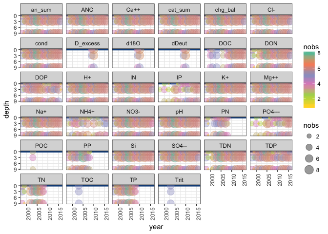
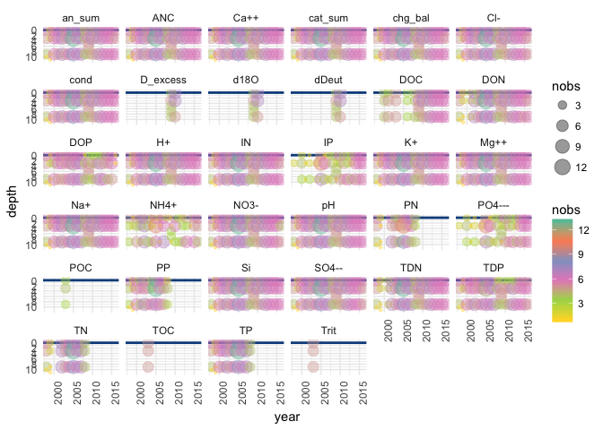

Water quality and chemistry data munging for Green Lake 4
================
CTW
2018-03-05

``` r
# Load needed libraries
library(tidyverse)
```

    ## ── Attaching packages ────────────────────────────────────────────────────── tidyverse 1.2.1 ──

    ## ✔ ggplot2 2.2.1     ✔ purrr   0.2.4
    ## ✔ tibble  1.3.4     ✔ dplyr   0.7.4
    ## ✔ tidyr   0.7.2     ✔ stringr 1.2.0
    ## ✔ readr   1.1.1     ✔ forcats 0.2.0

    ## ── Conflicts ───────────────────────────────────────────────────────── tidyverse_conflicts() ──
    ## ✖ dplyr::filter() masks stats::filter()
    ## ✖ dplyr::lag()    masks stats::lag()

``` r
library(lubridate)
```

    ## 
    ## Attaching package: 'lubridate'

    ## The following object is masked from 'package:base':
    ## 
    ##     date

``` r
# Read in water quality and water chemistry datasets on GL4

# --NA codes--
# u=Undetected
# DNS=Data Not Submitted
# EQCL=Exceeds Quality Control Limits
# N/A=Not Applicable
# NP=Not Performed
# NSS=No Sample Submitted
# NV=Not Valid
# QNS=Quantity Not Sufficient
# NA=Not available

# Nel Caine water chemistry dataset,  through 2014
Caine_waterchem <- read_csv("http://niwot.colorado.edu/data_csvs/gre4solu.nc.data.csv",
                          na = c("NaN", "DNS",  "EQCL", "N/A", "NP", "NSS", "NV", "u", "QNS", NA, " ", ""))
```

    ## Parsed with column specification:
    ## cols(
    ##   .default = col_double(),
    ##   samp_loc = col_character(),
    ##   year = col_integer(),
    ##   date = col_date(format = ""),
    ##   time = col_character(),
    ##   `NH4+` = col_character(),
    ##   `NO3-` = col_character(),
    ##   TDP = col_character()
    ## )

    ## See spec(...) for full column specifications.

``` r
# Diane McKnight water chemistry dataset, through 2016
# issues: year is wrong (has 1905 for 2014 and 2015 dates), TDP, IP and PO4 has "<" attached to some values
McKnight_waterchem <- read_csv("http://niwot.colorado.edu/data_csvs/glvwatsolu.dm.data.csv",
                               na = c("NaN", "DNS",  "EQCL", "N/A", "NP", "NSS", "NV", "u", "QNS", NA, " ", ""))
```

    ## Parsed with column specification:
    ## cols(
    ##   .default = col_double(),
    ##   LTER_site = col_character(),
    ##   local_site = col_character(),
    ##   year = col_integer(),
    ##   date = col_date(format = ""),
    ##   time = col_character(),
    ##   `depth/loc` = col_character(),
    ##   acid = col_character(),
    ##   alkal = col_character(),
    ##   `NH4+` = col_character(),
    ##   `PO4---` = col_character(),
    ##   TDP = col_character(),
    ##   IP = col_character(),
    ##   comments = col_character()
    ## )
    ## See spec(...) for full column specifications.

``` r
# Clean up and prep data

# Caine dataset --
Caine_GL4 <- dplyr::select(Caine_waterchem, -contains("sdev")) %>%
  subset(samp_loc == "GREEN LAKE 4") %>%
  gather(metric, value, pH:POC) %>%
  mutate(value = as.numeric(value)) %>%
  filter(!is.na(value))
```

    ## Warning in eval(substitute(expr), envir, enclos): NAs introduced by
    ## coercion

``` r
Caine_sdev <- dplyr::select(Caine_waterchem, samp_loc:time, contains("sdev")) %>%
  subset(samp_loc == "GREEN LAKE 4") %>%
  gather(sdev, sd_value, d18O_sdev:T_sdev) %>%
  mutate(metric = gsub("_sdev", "", sdev)) %>%
  filter(!is.na(sd_value))
Caine_sdev$metric <- gsub("dD", "dDeut", Caine_sdev$metric)
Caine_sdev$metric <- gsub("T", "Trit", Caine_sdev$metric)

Caine_long <- left_join(Caine_GL4, Caine_sdev) %>%
  mutate(doy = yday(date),
         # metatadata says June-Oct (summer conditions) samples taken from outlet, Nov-May under ice from lake
         location = ifelse(month(date) %in% 6:10, "Outlet", "Lake"),
         depth = ifelse(month(date) %in% 6:10, NA, 0),
         source = "Caine") %>%
  dplyr::select(-samp_loc)
```

    ## Joining, by = c("samp_loc", "year", "date", "time", "metric")

``` r
# McKnight dataset --
# fix year
McKnight_waterchem$year <- year(McKnight_waterchem$date)
# remove any values with "<" since not sure of value in context of other values
## TDP
summary(with(McKnight_waterchem, grepl("<", TDP))) # 13 observations true
```

    ##    Mode   FALSE    TRUE    NA's 
    ## logical     908      13       0

``` r
McKnight_waterchem$TDP <- as.numeric(with(McKnight_waterchem, ifelse(grepl("<", TDP), NA, TDP))) 
## IP
summary(with(McKnight_waterchem, grepl("<", IP))) # 19 observations true
```

    ##    Mode   FALSE    TRUE    NA's 
    ## logical     902      19       0

``` r
McKnight_waterchem$IP <- as.numeric(with(McKnight_waterchem, ifelse(grepl("<", IP), NA, IP)))
## PO4
summary(grepl("<", McKnight_waterchem$'PO4---')) # 19 observations true
```

    ##    Mode   FALSE    TRUE    NA's 
    ## logical     902      19       0

``` r
McKnight_waterchem$'PO4---' <- as.numeric(ifelse(grepl("<", McKnight_waterchem$`PO4---`), NA, McKnight_waterchem$'PO4---')) 

McKnight_GL4 <- dplyr::select(McKnight_waterchem, -contains("sdev")) %>%
  subset(local_site == "GL4") %>%
  gather(metric, value, pH:POC) %>%
  mutate(value = as.numeric(value)) %>%
  filter(!is.na(value))
```

    ## Warning in eval(substitute(expr), envir, enclos): NAs introduced by
    ## coercion

``` r
McKnight_sdev <- dplyr::select(McKnight_waterchem, LTER_site:`depth/loc`, contains("sdev")) %>%
  subset(local_site == "GL4") %>%
  gather(sdev, sd_value, d18O_sdev:T_sdev) %>%
  mutate(metric = gsub("_sdev", "", sdev)) %>%
  filter(!is.na(sd_value))
McKnight_sdev$metric <- gsub("dD", "dDeut", McKnight_sdev$metric)
McKnight_sdev$metric <- gsub("T", "Trit", McKnight_sdev$metric)

McKnight_long <- left_join(McKnight_GL4, McKnight_sdev) %>%
  mutate(doy = yday(date)) %>%
  dplyr::select(-LTER_site, -local_site, -comments) %>%
  # keep only these sample depths/locations for now
  filter(`depth/loc` %in% c("0m", "3m", "6m", "9m", "Surface", "Inlet", "Outlet")) %>%
  # split depth from location, and make depth numeric
  mutate(`depth/loc` = gsub("Surface", "0m", `depth/loc`),
         location = ifelse(grepl("m",`depth/loc`), "Lake",
                           ifelse(`depth/loc` == "Inlet", "Inlet", "Outlet")),
         depth = ifelse(location == "Lake", parse_number(`depth/loc`), NA),
         source = "McKnight") %>%
  dplyr::select(-`depth/loc`)
```

    ## Joining, by = c("LTER_site", "local_site", "year", "date", "time", "depth/loc", "metric")

    ## Warning: 6406 parsing failures.
    ## row # A tibble: 5 x 4 col     row   col expected actual expected   <int> <int>    <chr>  <chr> actual 1    19    NA a number Outlet row 2    20    NA a number Outlet col 3    21    NA a number Outlet expected 4    36    NA a number  Inlet actual 5    37    NA a number Outlet
    ## ... ................. ... ............................. ........ ............................. ...... ............................. ... ............................. ... ............................. ........ ............................. ...... .............................
    ## See problems(...) for more details.

``` r
# join both water chemistry datasets
GL4_waterchem <- rbind(Caine_long, McKnight_long)
```

``` r
# Compare outlet values by source
ggplot(subset(GL4_waterchem, location == "Outlet")) +
  geom_point(aes(date, value, col=source), alpha=0.5) +
  labs(x="Date", y ="Value", title = "GL4 water chemistry samples from outlet") +
  theme_light() +
  facet_wrap(~metric, scales = "free_y")
```


``` r
ggplot(subset(GL4_waterchem, location == "Lake" & depth == 0)) +
  geom_point(aes(date, value, col=source), alpha=0.5) +
  labs(x="Date", y ="Value", title = "GL4 water chemistry samples from lake surface") +
  theme_light() +
  facet_wrap(~metric, scales = "free_y")
```


``` r
# What is temporal frequency of data by measurement and site?
ggplot(GL4_waterchem, aes(date, value, col=source)) + 
         geom_point(alpha=0.3) +
  #geom_errorbar(aes(ymin = value - sd_value, ymax = value + sd_value), alpha=0.3) +
  labs(title = "Data availability at GL4, by dataset source and lake depth ('NA' refers to Outlet samples)") +
  theme_light() +
  facet_grid(metric~depth, scales = "free_y") +
  theme(strip.text.y = element_text(angle=360))
```



``` r
# What are characteristics of each site/depth and measurement through time?
ggplot(subset(McKnight_long, doy %in% 100:300), aes(doy, value)) + 
  geom_point(aes(col=year), alpha=0.3) +
  #geom_errorbar(aes(ymin = value - sd_value, ymax = value + sd_value), alpha=0.3) +
  labs(title = "McKnight water chemistry measurements, by day of year and metric") +
  scale_color_distiller(palette="PuBu") +
  theme_light() +
  facet_grid(metric~location*depth, scales = "free_y") +
  theme(strip.text.y = element_text(angle=360))
```



``` r
# Did errorbars add correctly? Yes!
ggplot(subset(test2, metric %in% c("d18O", "dDeut", "Trit")), aes(doy, value)) + 
  geom_point(aes(col=as.factor(year)), alpha=0.4) +
  geom_errorbar(aes(ymin = value - sd_value, ymax = value + sd_value, col=as.factor(year)), alpha=0.3) +
  theme_light() +
  facet_grid(local_site~metric, scales = "free_y")
```
