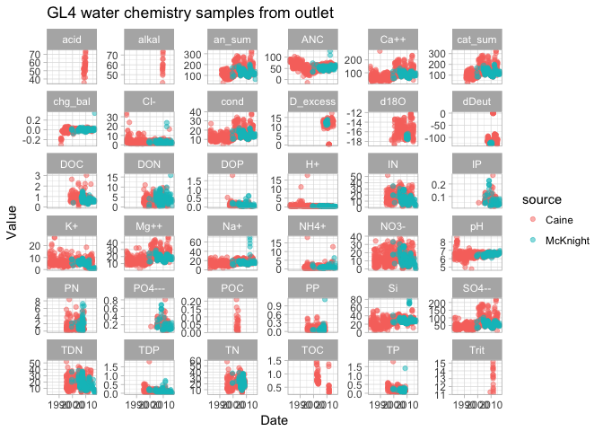
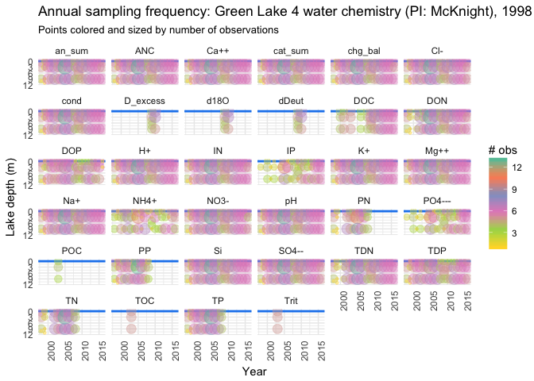

Water quality and chemistry data munging for Green Lake 4
================
CTW
2018-03-13

Script purpose
--------------

NWT LTER has a decades-long record of data collected annually or nearly so for lakes and streams in the Green Lakes Valley. A challenge in working with such a wealth of data is how to make sense of so much data: How to summarize? At what scale or frequency? What to summarize? What descriptive summary statistics to calculate (e.g. mean, max, min, metrics of variance)? and What should be related to what? This script is a first attempt in wrangling one NWT LTER's long term "core" datasets (actually two related datasets): water quality and water chemistry from Green Lakes Valley. A long-term data goal for NWT LTER is to make its data more accessible and intelligible to researchers and the public, to promote visibility of NWT LTER itself, the long-history of research conducted there and the core datasets in particular, as well as spur novel uses of the core datasets. A strategy for achieving this goal is to automate simple dataset clean up, preparation (transformation) needed for summarizing, and data visualization.

As such, the purposes of this script are to:

-   Read in relevant datasets directly from the NWT LTER website (these are more up to date than what's on the EDI data portal):
    -   **Green Lake 4 water chemistry** (PI: Nel Caine)
    -   **Green Lake Valley water chemistry** (PI: Diane McKnight)
    -   **Green Lake Valley water quality** (PI: Diane McKnight)
    -   **Lake ice clearance and formation** (PI: Nel Caine)
-   Visually assess each dataset for metrics, temporal and spatial range, and sampling frequency within those ranges
-   Asses which metrics and sites overlap between datasets
-   Focus on Green Lake 4 and combine water chemistry and water quality datasets to create master long-term aquatic ecology dataset for GL4
-   Test data summarizing and visualization (this will be a work in progress as CTW receives feedback)

I focus on Green Lake 4 because that is a site with greatest consistency of sampling through time (per Kelly Loria, and it shows in the data). With some exposure to NWT LTER from past field work and data tasks, and academic training and work experience in freshwater ecology, my experience going through these data and challenges incurred should be fairly representative of an outside researcher or someone with ecological knowledge interested in aquatic data (e.g. environmental science for the City of Boulder).

For comments or collaborations, email <caitlin.t.white@colorado.edu>, login to GitHub to add issues or items to the project board for this repository, or fork the repository to edit code and submit pull requests.

Setup
-----

``` r
# Load packages needed for reading in, transforming, and visualizing the data
library(tidyverse) # multiple handy packages bundled in one (e.g. ggplot, readr, tidyr, dplyr)
library(lubridate) # for dealing with time objects
```

``` r
# Read in water quality and water chemistry datasets on GL4, and ice phenology data

# --NA codes from online metadata--
# u=Undetected
# DNS=Data Not Submitted
# EQCL=Exceeds Quality Control Limits
# N/A=Not Applicable
# NP=Not Performed
# NSS=No Sample Submitted
# NV=Not Valid
# QNS=Quantity Not Sufficient
# NA=Not available
```

``` r
# Nel Caine GL4 water chemistry dataset, 1982 through 2014
Caine_GL4_waterchem <- read_csv("http://niwot.colorado.edu/data_csvs/gre4solu.nc.data.csv",
                                trim_ws = TRUE,
                                na = c("NaN", "DNS",  "EQCL", "N/A", "NP", "NSS", "NV", "u", "QNS", NA, " ", ""))

# Diane McKnight water chemistry dataset, 1998 through 2016
# issues: year is wrong (has 1905 for 2014 and 2015 dates), TDP, IP and PO4 have "<" with some numeric values, forcing numeric columns as character in data import
# also "<" creates an ambiguous value 
McKnight_GLV_waterchem <- read_csv("http://niwot.colorado.edu/data_csvs/glvwatsolu.dm.data.csv",
                                   trim_ws = TRUE,
                                   na = c("NaN", "DNS",  "EQCL", "N/A", "NP", "NSS", "NV", "u", "QNS", NA, " ", ""))

# Diane McKnight water quality dataset, 2000 through 2017
McKnight_GLV_WQdat <- read_csv("http://niwot.colorado.edu/data_csvs/water_quality_GLV.dm.data.csv", 
                      trim_ws = TRUE,
                      na = c("NaN", NA, "NA ", " ", ""))

## subset GL4 data
McKnight_GL4_WQdat <- McKnight_GLV_WQdat[McKnight_GLV_WQdat$local_site=="GL4",]

# read in GLV lake ice on and ice off dates, 1981 - 2015
GLV_icephenology <- read_csv("http://niwot.colorado.edu/data_csvs/glakeice.nc.data.csv",
                             trim_ws = TRUE,
                             na = c("NaN", NA, "NA ", " ", ""))
```

Clean up and prep data
----------------------

Here I transform datasets to long-form "tidy" data, which is better for data visualization in ggplot. Code is not shown unless I make a decision about data transformation (see R script for code). Something to note that I consistently do is break out the "depth/loc" field into two fields, "depth" and "location", so there aren't a mix of data types in one field (e.g. character and numeric). As demonstration, here is the structure of the raw data for the water quality dataset and unique values for the "depth/loc" field:

``` r
# fields in raw water quality dataset
names(McKnight_GLV_WQdat)
```

    ##  [1] "LTER_site"   "local_site"  "depth/loc"   "date"        "time"       
    ##  [6] "chl_a"       "pH"          "temp"        "std_conduct" "conduct"    
    ## [11] "DO"          "sat"         "secchi"      "light_att"   "surf_light" 
    ## [16] "depth_light" "DOC"         "comments"

``` r
# structure of raw data
head(McKnight_GLV_WQdat)
```

    ## # A tibble: 6 x 18
    ##   LTER_site local_site `depth/loc`       date     time chl_a    pH  temp
    ##       <chr>      <chr>       <chr>     <date>   <time> <dbl> <dbl> <dbl>
    ## 1       NWT        GL4       0.05m 2000-07-06 01:00:00    NA    NA    NA
    ## 2       NWT        GL4          3m 2000-07-06 01:00:00    NA    NA    NA
    ## 3       NWT        GL4          9m 2000-07-06 01:00:00    NA    NA    NA
    ## 4       NWT        GL4       0.05m 2000-07-06       NA  1.34    NA    NA
    ## 5       NWT        GL4          3m 2000-07-06       NA  1.34    NA    NA
    ## 6       NWT        GL4          9m 2000-07-06       NA  3.34    NA    NA
    ## # ... with 10 more variables: std_conduct <dbl>, conduct <dbl>, DO <dbl>,
    ## #   sat <dbl>, secchi <dbl>, light_att <dbl>, surf_light <dbl>,
    ## #   depth_light <dbl>, DOC <dbl>, comments <chr>

``` r
# unique values of depth-location
unique(McKnight_GLV_WQdat$`depth/loc`)
```

    ##  [1] "0.05m"                 "3m"                   
    ##  [3] "9m"                    "8.1m"                 
    ##  [5] "9.3m"                  "9.5m"                 
    ##  [7] "10.4m"                 "10.5m"                
    ##  [9] "10.3m"                 "9.8m"                 
    ## [11] "10.6m"                 "10.7m"                
    ## [13] "8.5m"                  "10.9m"                
    ## [15] "12.3m"                 "11.7m"                
    ## [17] "9.2m"                  "12.1m"                
    ## [19] "12.2m"                 "Surface"              
    ## [21] "1m"                    "2m"                   
    ## [23] "4m"                    "5m"                   
    ## [25] "6m"                    "7m"                   
    ## [27] "8m"                    "Middle lake at 1m"    
    ## [29] "Inlet"                 "Outlet"               
    ## [31] "Second inlet"          "Inlet at rock glacier"
    ## [33] "Middle lake at 0.05m"  "Middle lake at 3m"    
    ## [35] "Middle lake at 6m"     "3.75m"                
    ## [37] "1.75m"                 "10m"                  
    ## [39] "11m"                   "12m"                  
    ## [41] "13m"                   NA                     
    ## [43] "0m"                    "Air"                  
    ## [45] "14m"

There are 45 different possible values for depth-location, some of which are actual lake depths and some not. For an outside researcher potentially interested in using the water quality dataset, this is confusing. For example, the online metadata describe the sampling location as the middle of the lake (<http://niwot.colorado.edu/meta_data/water_quality_GLV.dm.meta.txt>). What then is the difference between a "depth/loc" value of "1m" and "Middle lake at 1m"? What depths are "Inlet", "Outlet", and "Air"? Was the "Air" sample taken in the middle of the lake? Inlet? Outlet? These are some questions I can imagine a person who'd like use GLV water quality data having, and for that reason it's cleaner to separate depth from location, and is something that should be considered for how data are recorded and entered. While there are 45 unique "depth/loc" values in the water quality dataset, there are **122** unique values for "depth/loc" in the McKnight water chemistry dataset, even though that dataset only includes 1 additional site (Green Lake 3) compared to the McKnight water quality dataset:

``` r
# sites sampled in the water quality dataset
unique(McKnight_GLV_WQdat$local_site)
```

    ## [1] "GL4" "GL5" "GL1" "ALB"

``` r
# sites sampled in the water chemistry dataset
unique(McKnight_GLV_waterchem$local_site)
```

    ## [1] "GL3" "GL4" "GL1" "ALB" "GL5"

Kelly Loria has suggested breaking out the "core" water quality and chemistry data (data collected consistently through time) from the McKnight (ongoing) water quality and water chemistry datasets, and keeping infrequently-sampled water quality and water chemistry data in an auxiliary or experimental dataset. For example, some of the "depth/loc" values in the water chemistry dataset are from single-season REU projects (email communication from DMK to KL). In my experience trying to summarize these datasets, and figure out which values are appropriate for summarizing, having a true "core" dataset separate from an auxiliary or experimental dataset makes sense to me.

Working through the McKnight water chemistry dataset, there are a few other issues to mention in the raw data. I show code to illustrate:

-   1905 erroneously entered for the year 2015 in the "year" column

``` r
# McKnight water chemistry dataset --
# show problem with year (1905 entered instead of 2015)
## all unique "year" values in dataset
unique(McKnight_GLV_waterchem$year)
```

    ##  [1] 1998 1999 2000 2001 2002 2003 2004 2005 2006 2007 2008 2009 2010 2011
    ## [15] 2012 2013 1905 2016

``` r
## all unique "year" values when filtering the dataset for dates from the year 2015
unique(McKnight_GLV_waterchem$year[year(McKnight_GLV_waterchem$date)==2015])
```

    ## [1] 1905

``` r
# fix year
McKnight_GLV_waterchem$year <- year(McKnight_GLV_waterchem$date)
```

-   Three numeric fields (TDP, IP, and PO4) have "&lt;" entered, coercing the entire field in R as a character instead of numeric when it's read in. "&lt;" is also an ambiguous value (I know it doesn't exceed a certain level, but I can't say whether "&lt;5" is 4 or 1 which could make a difference for averaging or determining minimum values). Since I'm not sure of the true value, I exclude anything with "&lt;" for summarizing.

``` r
# remove any values with "<" since not sure of value in context of other values
## TDP ##
# how many values have "<"?
summary(with(McKnight_GLV_waterchem, grepl("<", TDP)))
```

    ##    Mode   FALSE    TRUE    NA's 
    ## logical     908      13       0

``` r
# assign NA to any "<" value, convert field to numeric
McKnight_GLV_waterchem$TDP <- as.numeric(with(McKnight_GLV_waterchem, ifelse(grepl("<", TDP), NA, TDP))) # if true has "<"

## IP ##
# how many values have "<"?
summary(with(McKnight_GLV_waterchem, grepl("<", IP))) # if true has "<"
```

    ##    Mode   FALSE    TRUE    NA's 
    ## logical     902      19       0

``` r
# assign NA to any "<" value, convert field to numeric
McKnight_GLV_waterchem$IP <- as.numeric(with(McKnight_GLV_waterchem, ifelse(grepl("<", IP), NA, IP)))

## PO4 ## 
# how many values have "<"?
summary(grepl("<", McKnight_GLV_waterchem$'PO4---')) # if true has "<"
```

    ##    Mode   FALSE    TRUE    NA's 
    ## logical     902      19       0

``` r
# assign NA to any "<" value, convert field to numeric
McKnight_GLV_waterchem$'PO4---' <- as.numeric(ifelse(grepl("<", McKnight_GLV_waterchem$`PO4---`), NA, McKnight_GLV_waterchem$'PO4---')) 
```

Exluding these "&lt;" values also seems reasonable because they represent a small fraction (2% or less) of all observations within each field.

Visualize data availability
---------------------------

The following figures show data availability, temporal and depth ranges, and sampling frequency within for the tidied long-form datasets.


``` r
# Compare outlet values by source
ggplot(subset(GL4_waterchem, location == "Outlet")) +
  geom_point(aes(date, value, col=source), alpha=0.5) +
  labs(x="Date", y ="Value", title = "GL4 water chemistry samples from outlet") +
  theme_light() +
  facet_wrap(~metric, scales = "free_y")
```



``` r
ggplot(subset(GL4_waterchem, location == "Lake" & depth == 0)) +
  geom_point(aes(date, value, col=source), alpha=0.5) +
  labs(x="Date", y ="Value", title = "GL4 water chemistry samples from lake surface") +
  theme_light() +
  facet_wrap(~metric, scales = "free_y")
```


``` r
# What is temporal frequency of data by measurement and site?
ggplot(GL4_waterchem, aes(date, value, col=source)) + 
         geom_point(alpha=0.3) +
  #geom_errorbar(aes(ymin = value - sd_value, ymax = value + sd_value), alpha=0.3) +
  labs(title = "Data availability at GL4, by dataset source and lake depth ('NA' refers to Outlet samples)") +
  theme_light() +
  facet_grid(metric~depth, scales = "free_y") +
  theme(strip.text.y = element_text(angle=360))
```



``` r
# What are characteristics of each site/depth and measurement through time?
ggplot(subset(McKnight_long, doy %in% 100:300), aes(doy, value)) + 
  geom_point(aes(col=year), alpha=0.3) +
  #geom_errorbar(aes(ymin = value - sd_value, ymax = value + sd_value), alpha=0.3) +
  labs(title = "McKnight water chemistry measurements, by day of year and metric") +
  scale_color_distiller(palette="PuBu") +
  theme_light() +
  facet_grid(metric~location*depth, scales = "free_y") +
  theme(strip.text.y = element_text(angle=360))
```


``` r
# Did errorbars add correctly? Yes!
ggplot(subset(test2, metric %in% c("d18O", "dDeut", "Trit")), aes(doy, value)) + 
  geom_point(aes(col=as.factor(year)), alpha=0.4) +
  geom_errorbar(aes(ymin = value - sd_value, ymax = value + sd_value, col=as.factor(year)), alpha=0.3) +
  theme_light() +
  facet_grid(local_site~metric, scales = "free_y")
```

``` r
GL4_WQ_long <- McKnight_GL4_WQdat %>%
  dplyr::select(-comments) %>%
  gather(metric, value, chl_a:DOC) %>%
  filter(!is.na(value)) %>%
  mutate(doy = yday(date),
    yr = year(date),
         depth = ifelse(`depth/loc`== "Surface", 0, parse_number(`depth/loc`)),
         location = ifelse(`depth/loc`== "Inlet", "Inlet",
                           ifelse(`depth/loc`== "Outlet", "Outlet", "Lake")))
```

    ## Warning: 1122 parsing failures.
    ## row # A tibble: 5 x 4 col     row   col expected actual expected   <int> <int>    <chr>  <chr> actual 1    61    NA a number  Inlet row 2    62    NA a number Outlet col 3    66    NA a number  Inlet expected 4    67    NA a number Outlet actual 5    71    NA a number  Inlet
    ## ... ................. ... ............................. ........ ............................. ...... ............................. ... ............................. ... ............................. ........ ............................. ...... .............................
    ## See problems(...) for more details.

``` r
GL4_WQ_long$location[is.na(GL4_WQ_long$location)] <- "Lake" # fix NA value
GL4_WQ_long$depth[is.na(GL4_WQ_long$depth)] <- -1 # assign depth of -1 for anything measured in air or not in lake

# what is sampling frequency by depth over time?
# lake only
GL4_WQ_long %>%
  filter(location == "Lake") %>%
  group_by(yr, location, depth, metric) %>%
  summarise(nobs = length(metric)) %>%
  ggplot() +
  geom_vline(aes(xintercept=0), col="dodgerblue4", lwd=1) +
  geom_point(aes(depth, yr, group=depth,  col=nobs, size=nobs), alpha=0.4) +
  scale_color_distiller(palette = "Set2", breaks=seq(2,12,2)) +
  scale_size_continuous(breaks=seq(1,12,3)) +
  scale_x_reverse(breaks=seq(0,12,3)) +
  theme_bw() +
  theme(axis.text.x = element_text(angle = 90)) +
  coord_flip() +
  facet_grid(location~metric)
```


``` r
# inlet and outlet sampling frequency
GL4_WQ_long %>%
  filter(location != "Lake") %>%
  group_by(yr, location, depth, metric) %>%
  summarise(nobs = length(metric)) %>%
  ggplot() +
  geom_col(aes(yr, nobs, fill=location), width=0.7) +
  scale_fill_brewer(palette = "Paired") +
  theme_bw() +
  theme(axis.text.x = element_text(angle = 90)) +
  facet_grid(location~metric, scales = "free_y")
```


``` r
## Date frequency
GL4_waterchem %>%
  dplyr::select(year, date, doy, location, source) %>%
  distinct() %>%
  mutate(term = ifelse(month(date) %in% 6:10, "Summer", "Winter")) %>%
  group_by(year, term, location, source) %>%
  mutate(nobs = length(doy)) %>%
  filter(source == "McKnight") %>%
  ggplot(aes(doy, year)) +
  geom_path(aes(col=nobs, group=year)) +
  geom_point(aes(col=nobs), alpha=0.8) +
  labs(y="Year", x="Day of year", title = "Dates sampled, by year and location for GL4") +
  scale_x_continuous(labels = function(x) format(as.Date(as.character(x), "%j"), "%d-%b"),
                     breaks = yday(c("2018-01-01", "2018-02-01", "2018-03-01", "2018-04-01", 
                                     "2018-05-01", "2018-06-01", "2018-07-01", "2018-08-01", 
                                     "2018-09-01", "2018-10-01", "2018-11-01", "2018-12-01"))) +
  scale_y_continuous(breaks = seq(1980,2016,4)) +
  scale_color_distiller(name = "# obs/yr", palette= "Set2", breaks=seq(0,15, 3)) +
  theme_bw() +
  theme(axis.text.x = element_text(angle=45)) +
  facet_grid(location~source)
```


``` r
GL4_WQ_long %>%
  dplyr::select(yr, date, doy, location) %>%
  distinct() %>%
  #mutate(term = ifelse(month(date) %in% 6:10, "Summer", "Winter")) %>%
  group_by(yr, location) %>%
  mutate(nobs = length(doy)) %>%
  #left_join(ice_off[c("year", "gl4_doy")], by = c("yr" = "year")) %>%
  #filter(source == "McKnight") %>%
  ggplot(aes(doy, yr)) +
  geom_point(data= subset(GLV_ice_long, year > 1999 & lake == "Green4" & event == "clear"), aes(event_doy, year), col="dodgerblue", size = 2) +
  geom_point(data= subset(GLV_ice_long, year > 1999 & lake == "Green4" & event == "break"), aes(event_doy, year), col="lightblue", size = 2) +
  geom_path(aes(col=nobs, group=yr)) +
  geom_point(aes(col=nobs), alpha=0.8) +
  labs(y="Year", x="Day of year", title = "Dates sampled, by year and location for GL4") +
  scale_x_continuous(labels = function(x) format(as.Date(as.character(x), "%j"), "%d-%b"),
                     breaks = yday(c("2018-01-01", "2018-02-01", "2018-03-01", "2018-04-01",
                                     "2018-05-01", "2018-06-01", "2018-07-01", "2018-08-01",
                                     "2018-09-01", "2018-10-01", "2018-11-01", "2018-12-01"))) +
  scale_y_continuous(breaks = seq(1980,2016,4)) +
  scale_color_distiller(name = "# obs/yr", palette= "Set2", breaks=seq(0,15, 3)) +
  theme_bw() +
  theme(axis.text.x = element_text(angle=45)) +
  facet_grid(location~.)
```


``` r
# plot first date sampled in lakes each year, just to see if trend overtime in timing
GL4_WQ_long %>%
  dplyr::select(yr, date, doy, location) %>%
  distinct() %>%
  #mutate(term = ifelse(month(date) %in% 6:10, "Summer", "Winter")) %>%
  group_by(yr, location) %>%
  filter(date == min(date)) %>%
  ggplot(aes(yr,doy)) +
  #geom_path(aes(col=nobs, group=yr)) +
  geom_point(data= subset(GLV_ice_long, year > 1999 & event == "clear" & lake == "Green4"), aes(year, event_doy), col="dodgerblue", size = 2) +
  geom_point(data= subset(GLV_ice_long, year > 1999 & event == "break" & lake == "Green4"), aes(year, event_doy), col="lightblue", size = 2) +
  geom_point() +
  geom_smooth(method = "lm", col="grey50") +
  #geom_smooth(data= subset(GLV_ice_long, year > 1999 & event == "clear" & lake == "Green4"), aes(year, event_doy), col="dodgerblue", method="lm") +
  labs(x="Year", y="Day of year", title = "Dates sampled, by year and location for GL4") +
  scale_y_continuous(labels = function(x) format(as.Date(as.character(x), "%j"), "%d-%b"),
                     breaks = yday(c("2018-06-01", "2018-06-15", "2018-07-01", "2018-07-15",
                                     "2018-08-01", "2018-08-15", "2018-09-01"))) +
  scale_x_continuous(breaks = seq(1980,2016,4)) +
  #scale_color_distiller(name = "# obs/yr", palette= "Set2", breaks=seq(0,15, 3)) +
  theme_bw() +
  #theme(axis.text.x = element_text(angle=45)) +
  facet_grid(location~.)
```


