Compare precip and temp from chart, Emily's data, and Jennings et al.
================
CTW
2018-09-23

**Goal**: Figure out how best to infill precip and temp for years 2015, 2016, 2017

### Time ranges of each dataset..

    ## Observations: 13,303
    ## Variables: 7
    ## $ LTER_site    <chr> "NWT", "NWT", "NWT", "NWT", "NWT", "NWT", "NWT", ...
    ## $ local_site   <chr> "sdl", "sdl", "sdl", "sdl", "sdl", "sdl", "sdl", ...
    ## $ date         <date> 1981-07-31, 1981-08-01, 1981-08-02, 1981-08-03, ...
    ## $ ppt_tot      <int> 1, 0, 0, 1, 0, 0, 0, 1, 2, 7, 1, NA, NA, NA, NA, ...
    ## $ qdays        <int> 1, 1, 1, 1, 1, 1, 1, 1, 1, 1, 1, NA, NA, NA, NA, ...
    ## $ flag_ppt_tot <int> NA, NA, NA, NA, NA, NA, NA, NA, NA, NA, NA, NA, N...
    ## $ source       <chr> "chart", "chart", "chart", "chart", "chart", "cha...

    ## Observations: 23,833
    ## Variables: 7
    ## $ LTER_site    <chr> "NWT", "NWT", "NWT", "NWT", "NWT", "NWT", "NWT", ...
    ## $ local_site   <chr> "c1", "c1", "c1", "c1", "c1", "c1", "c1", "c1", "...
    ## $ date         <date> 1952-10-01, 1952-10-02, 1952-10-03, 1952-10-04, ...
    ## $ ppt_tot      <int> 0, 0, 0, NA, NA, NA, NA, 3, NA, NA, NA, NA, NA, N...
    ## $ qdays        <int> 1, 1, 1, NA, NA, NA, NA, 5, NA, NA, NA, NA, NA, N...
    ## $ flag_ppt_tot <chr> NA, NA, NA, NA, NA, NA, NA, NA, NA, NA, NA, NA, N...
    ## $ source       <chr> "chart", "chart", "chart", "chart", "chart", "cha...

    ## Observations: 19,450
    ## Variables: 7
    ## $ LTER_site    <chr> "NWT", "NWT", "NWT", "NWT", "NWT", "NWT", "NWT", ...
    ## $ local_site   <chr> "d1", "d1", "d1", "d1", "d1", "d1", "d1", "d1", "...
    ## $ date         <date> 1964-10-01, 1964-10-03, 1964-10-04, 1964-10-02, ...
    ## $ pppt_tot     <int> 0, 0, 0, 0, 0, 0, 0, 0, 0, 0, NA, NA, NA, NA, NA,...
    ## $ qdays        <int> 1, 1, 1, 1, 1, 1, 1, 1, 1, 1, NA, NA, NA, NA, NA,...
    ## $ flag_ppt_tot <int> NA, NA, NA, NA, NA, NA, NA, NA, NA, NA, NA, NA, N...
    ## $ source       <chr> "chart", "chart", "chart", "chart", "chart", "cha...

    ## Observations: 13,325
    ## Variables: 9
    ## $ LTER_site        <chr> "NWT", "NWT", "NWT", "NWT", "NWT", "NWT", "NW...
    ## $ local_site       <chr> "sdl", "sdl", "sdl", "sdl", "sdl", "sdl", "sd...
    ## $ date             <date> 1981-07-09, 1981-07-10, 1981-07-11, 1981-07-...
    ## $ airtemp_max      <dbl> 11.0, 13.0, 15.0, 13.0, 10.0, 12.8, 14.0, 12....
    ## $ flag_airtemp_max <int> NA, NA, NA, NA, NA, 2, NA, NA, NA, NA, NA, NA...
    ## $ airtemp_min      <dbl> 6.0, 5.0, 6.0, 5.0, 5.0, 2.3, 6.0, 5.0, 5.0, ...
    ## $ flag_airtemp_min <int> NA, NA, NA, NA, NA, 2, NA, NA, NA, NA, NA, NA...
    ## $ airtemp_avg      <dbl> 8.5, 9.0, 10.5, 9.0, 7.5, 7.6, 10.0, 8.5, 8.5...
    ## $ source           <chr> "chart", "chart", "chart", "chart", "chart", ...

    ## Observations: 23,833
    ## Variables: 9
    ## $ LTER_site        <chr> "NWT", "NWT", "NWT", "NWT", "NWT", "NWT", "NW...
    ## $ local_site       <chr> "c1", "c1", "c1", "c1", "c1", "c1", "c1", "c1...
    ## $ date             <date> 1952-10-01, 1952-10-02, 1952-10-03, 1952-10-...
    ## $ airtemp_max      <dbl> 16, 16, 16, 14, 5, 4, 14, 16, 17, 15, 14, 13,...
    ## $ flag_airtemp_max <int> NA, NA, NA, NA, NA, NA, NA, NA, NA, NA, NA, N...
    ## $ airtemp_min      <dbl> -1, -2, -1, -4, -6, -5, -1, -1, -1, 0, -1, 4,...
    ## $ flag_airtemp_min <int> NA, NA, NA, NA, NA, NA, NA, NA, NA, NA, NA, N...
    ## $ airtemp_avg      <dbl> 7.5, 7.0, 7.5, 5.0, -0.5, -0.5, 6.5, 7.5, 8.0...
    ## $ source           <chr> "chart", "chart", "chart", "chart", "chart", ...

    ## Observations: 23,833
    ## Variables: 9
    ## $ LTER_site        <chr> "NWT", "NWT", "NWT", "NWT", "NWT", "NWT", "NW...
    ## $ local_site       <chr> "d1", "d1", "d1", "d1", "d1", "d1", "d1", "d1...
    ## $ date             <date> 1952-10-01, 1952-10-02, 1952-10-03, 1952-10-...
    ## $ airtemp_max      <dbl> 9, 8, 9, 7, 2, -2, 8, 9, 10, 8, 6, 6, 4, -2, ...
    ## $ flag_airtemp_max <int> NA, NA, NA, NA, NA, NA, NA, NA, NA, NA, NA, N...
    ## $ airtemp_min      <dbl> -2, 0, 1, 1, -7, -7, -3, 0, 2, -1, -1, 0, -2,...
    ## $ flag_airtemp_min <int> NA, NA, NA, NA, NA, NA, NA, NA, NA, NA, NA, N...
    ## $ airtemp_avg      <dbl> 3.5, 4.0, 5.0, 4.0, -2.5, -4.5, 2.5, 4.5, 6.0...
    ## $ source           <chr> "chart", "chart", "chart", "chart", "chart", ...

    ## Observations: 6,035
    ## Variables: 12
    ## $ LTER_site        <chr> "NWT", "NWT", "NWT", "NWT", "NWT", "NWT", "NW...
    ## $ local_site       <chr> "sdl", "sdl", "sdl", "sdl", "sdl", "sdl", "sd...
    ## $ logger           <chr> "cr23x", "cr23x", "cr23x", "cr23x", "cr23x", ...
    ## $ date             <date> 2000-06-24, 2000-06-25, 2000-06-26, 2000-06-...
    ## $ year             <int> 2000, 2000, 2000, 2000, 2000, 2000, 2000, 200...
    ## $ jday             <int> 176, 177, 178, 179, 180, 181, 182, 183, 184, ...
    ## $ airtemp_max      <dbl> 15.55, 11.71, 8.83, NaN, NaN, 14.96, 16.79, 1...
    ## $ flag_airtemp_max <chr> "n", "n", "n", "n", "n", "n", "n", "n", "n", ...
    ## $ airtemp_min      <dbl> 6.385, 3.172, 2.451, 1.962, 1.756, 4.028, 3.0...
    ## $ flag_airtemp_min <chr> "n", "n", "n", "n", "n", "n", "n", "n", "n", ...
    ## $ airtemp_avg      <dbl> 10.250, 7.380, 4.255, 5.734, 6.723, 10.780, 1...
    ## $ flag_airtemp_avg <chr> "n", "n", "n", "n", "n", "n", "n", "n", "n", ...

    ## Observations: 26,298
    ## Variables: 10
    ## $ LTER_site   <chr> "NWT", "NWT", "NWT", "NWT", "NWT", "NWT", "NWT", "...
    ## $ local_site  <chr> "c1", "c1", "c1", "c1", "c1", "c1", "c1", "c1", "c...
    ## $ year        <int> 1990, 1990, 1990, 1990, 1990, 1990, 1990, 1990, 19...
    ## $ date        <date> 1990-01-01, 1990-01-02, 1990-01-03, 1990-01-04, 1...
    ## $ jday        <int> 1, 2, 3, 4, 5, 6, 7, 8, 9, 10, 11, 12, 13, 14, 15,...
    ## $ source      <chr> "Jennings et al.", "Jennings et al.", "Jennings et...
    ## $ ppt_tot     <dbl> 0.21, 4.83, 0.00, 0.00, 0.00, 0.00, 0.33, 7.72, 2....
    ## $ airtemp_max <dbl> -3.8670833, -4.5070833, -11.5520833, -10.4954167, ...
    ## $ airtemp_min <dbl> -10.13, -11.21, -17.01, -13.21, -12.69, -7.88, -4....
    ## $ airtemp_avg <dbl> -3.8670833, -4.5070833, -11.5520833, -10.4954167, ...

    ## Observations: 12,207
    ## Variables: 7
    ## $ Year   <int> 1981, 1981, 1981, 1981, 1981, 1981, 1981, 1981, 1981, 1...
    ## $ Month  <int> 7, 8, 8, 8, 8, 8, 8, 8, 8, 8, 8, 8, 8, 8, 8, 8, 8, 8, 8...
    ## $ Day    <int> 31, 1, 2, 3, 4, 5, 6, 7, 8, 9, 10, 11, 12, 13, 14, 15, ...
    ## $ TMIN   <dbl> 6, 7, 7, 7, 8, 6, 1, 0, -2, 2, 0, -1, 2, 2, 3, 2, 3, 2,...
    ## $ TMAX   <dbl> 17, 13, 17, 15, 17, 15, 14, 7, 11, 7, 5, 6, 6, 10, 12, ...
    ## $ PCP    <dbl> 1, 0, 0, 1, 0, 0, 0, 1, 2, 7, 1, 0, 0, 0, 0, 0, 0, 15, ...
    ## $ source <chr> "NSF proposal data", "NSF proposal data", "NSF proposal...

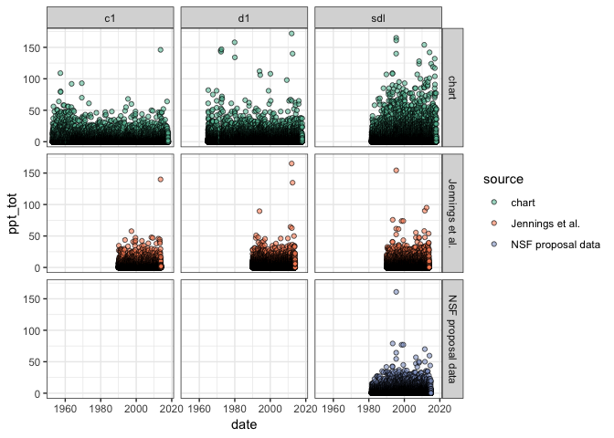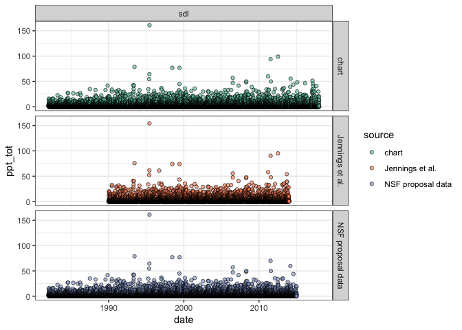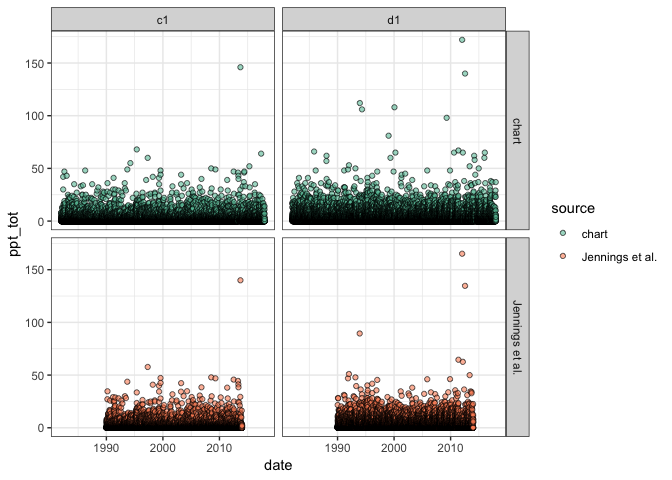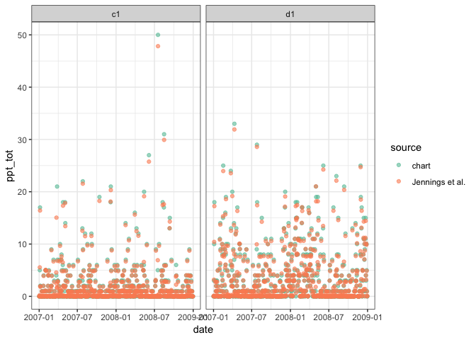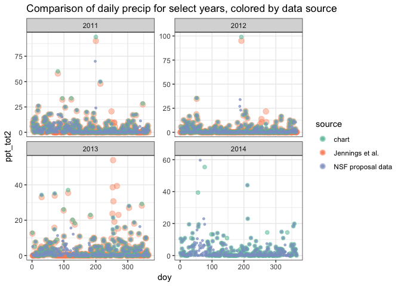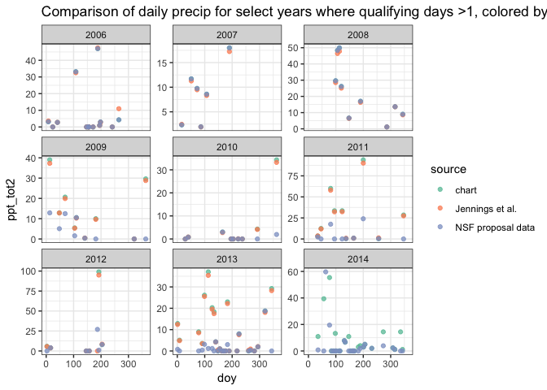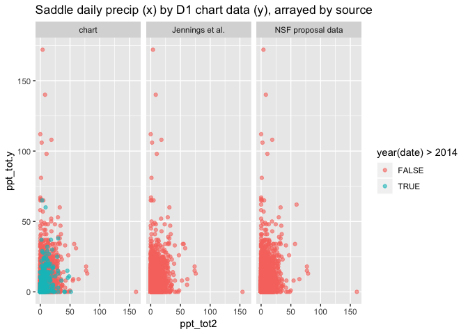 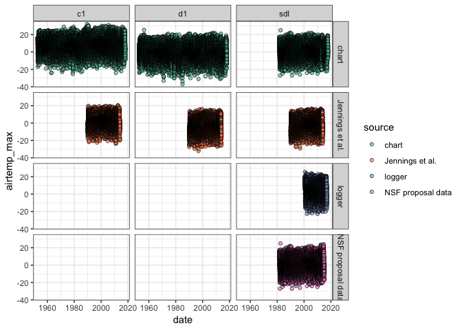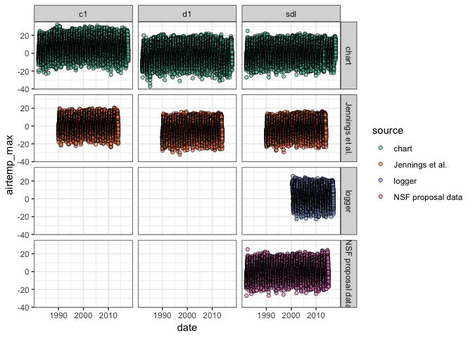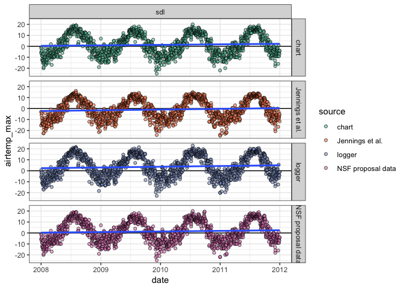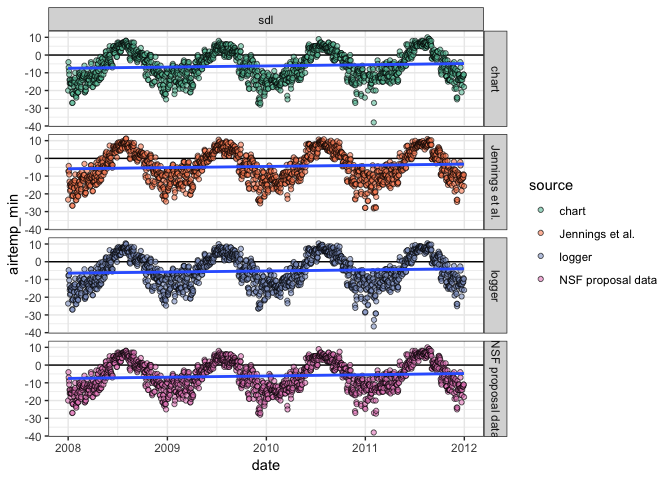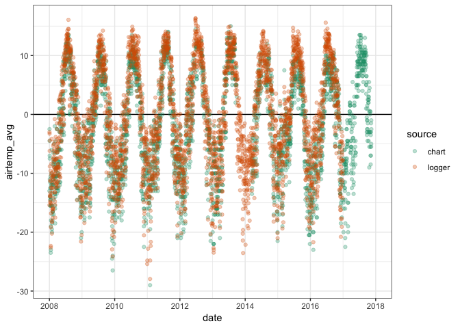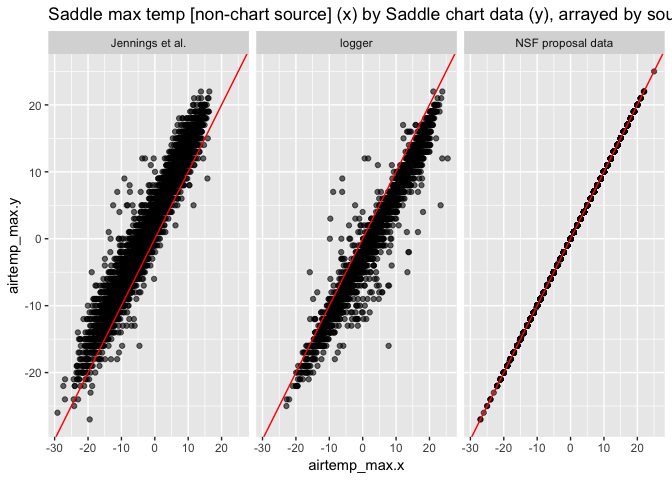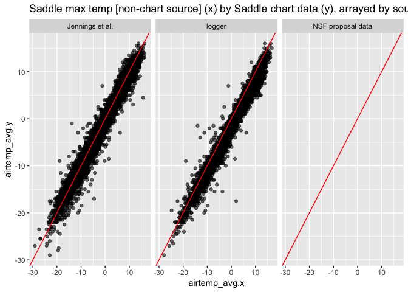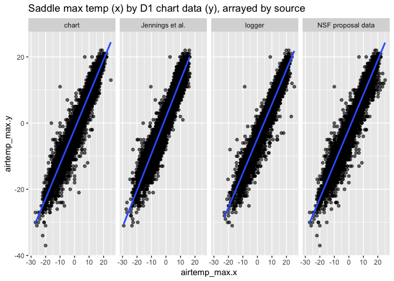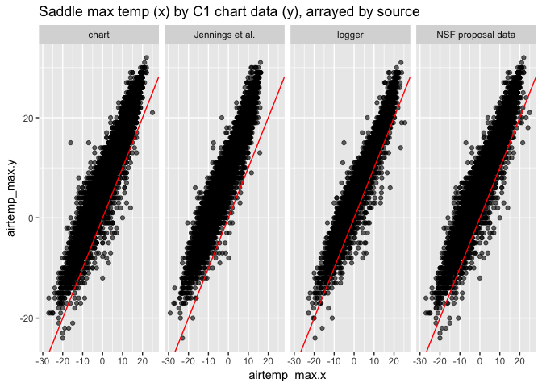
