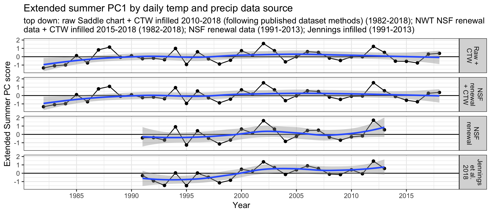
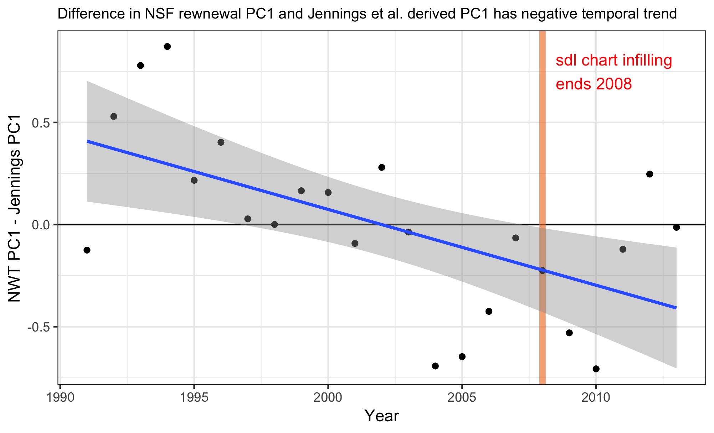
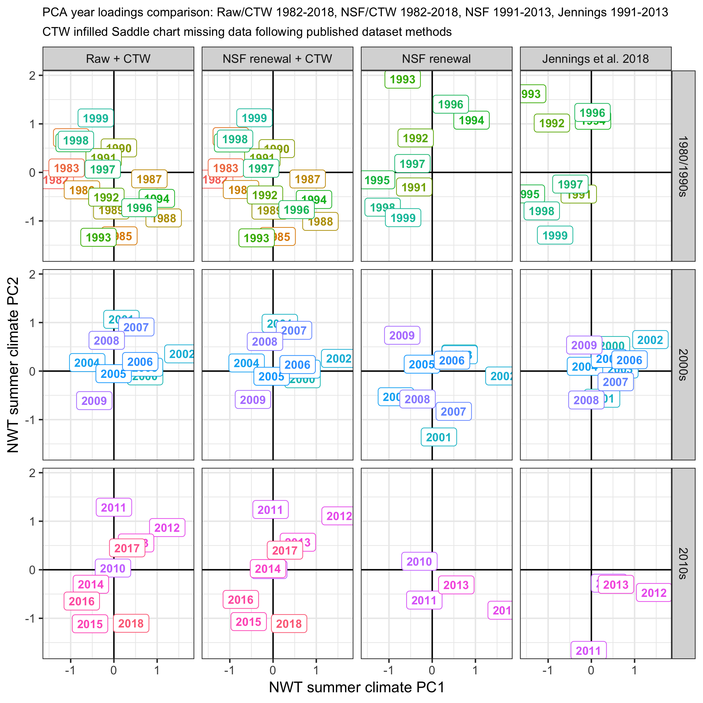
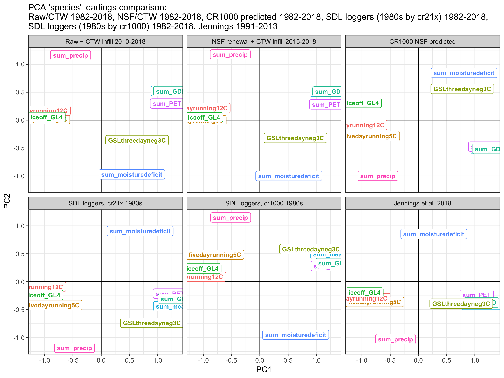
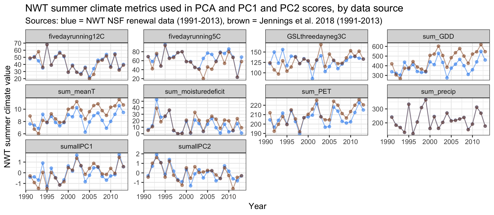
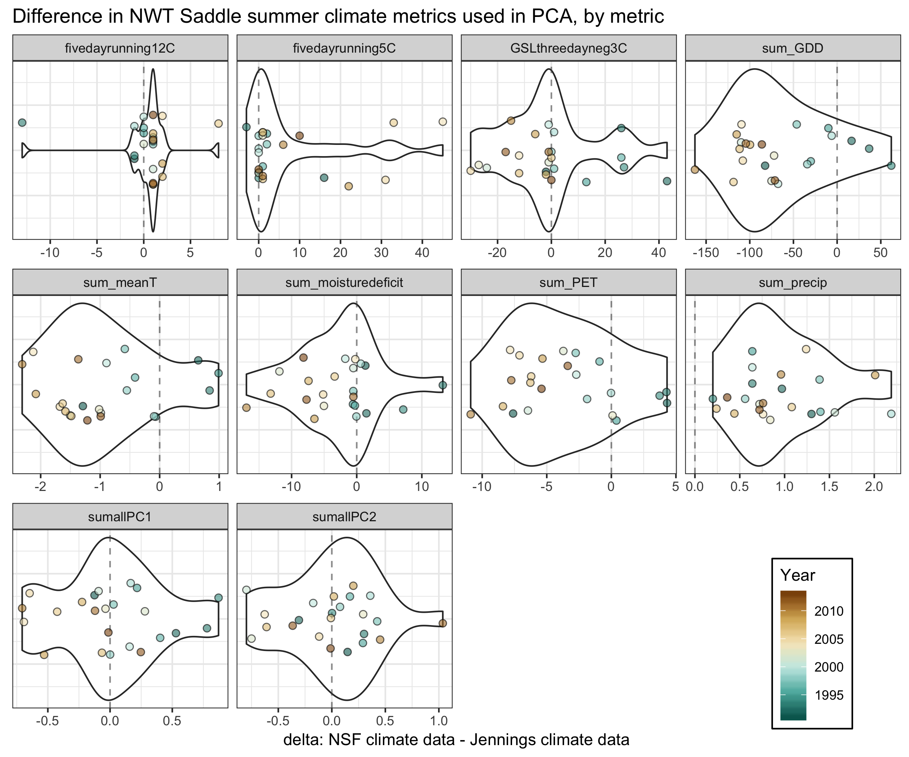

Extended summer PCA sensitivity analysis (preliminary)
================
CTW
2019-06-17

### Sensitivity of extended summer scores and input metrics to source precip/temp dataset

Regardless of input dataset used, PC1 explains 50% of the variation in the summer climate data.

Fig 1.  Fig 2. 

Fig 3.  Fig 4. 

Fig 5.  Fig 6. 

### Compare PCA input data using Saddle chart vs. Saddle logger temperature

The following figure compares Extended Summer PCA input variables derived from different saddle temperature datasets. The NWT renewal panel shows data used in the NWT NSF renewal (1982-2014), with 2015-2017 saddle chart-derived values appeneded and 2018 saddle-chart projected from cr1000 (the Saddle chart temperature data was discontinued after 2017-12-31.) The CR1000 + CR1000 projected panel shows values derived from the CR1000 dat logger (2013-ongoing) + CR1000 projected backwards to 1982 from the saddle chart. The last two panels show PCA input variables derived from the saddle logger datasets (1986-ongoing), with 1982-1986 logger-projected using two different loggers: the current logger (cr1000) and the logger active closest-in-time the 1980s saddle chart data (cr21x). The grey shaded area denotes the period logger temperature was projected backwards from the saddle chart. The dark blue vertical lines denote years when new saddle data loggers were launched (we estimate the sensor used in the logger was the same since 1995/1996 regardless of logger changes). Although shown, values for 2015 and 2016 in the NWT renewal panel should be ignored because temperature data from Mar 2015-Aug 2016 in the saddle chart are bad (update to dataset not done yet). Because backwards-projected logger values using the saddle chart and cr21x logger are most similar to the values using the saddle chart, I recommend using the cr21x logger to backfill if we decide to use the Saddle logger data.

### Compare raw source data

Some visuals of the raw data to highlight the origin of the any differences above..

Looking at the raw data, precipitation in the two source datasets overlaps well except for a handful of differences in later years. The extended summer analysis strongly considers just summer months' (JJA) precipitation, which overlaps well in all years (not shown). TMIN and TMAX tend to have warmer values in the Jennings infilled dataset. The NWT NSF data have a single max temp and min temp value per day, whereas the Jennings dataset provides hourly average air temperature. I took the max and min of those hourly values, per day, which gives the Jennings TMIN and TMAX values shown here. Daily TMEAN used in the extended summer analysis is the average of daily TMIN and TMAX.

Looking at temperature by season, the biggest differences are in the summer months (JJA):

Spring and fall temperatures in both datasets overlap better compared to the summer months. For metrics used in the extended summer PCA, spring temperature values are used to calculate warming temperature thresholds ("fivedayrunning5C" and "fivedayrunnings12C"). Fall temperature values are used to calculate 3-day running minimum temperature thresholds ("GSLthreedayneg3C").

