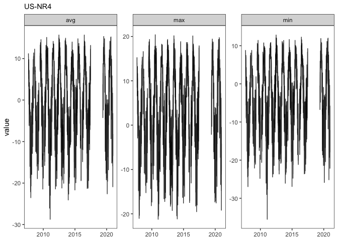
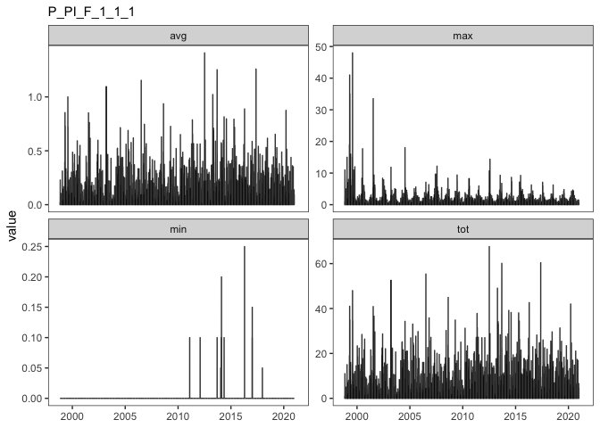
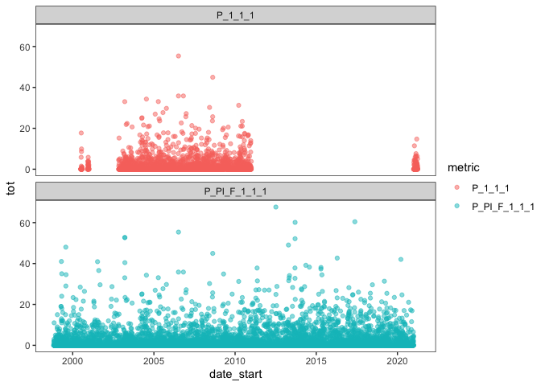
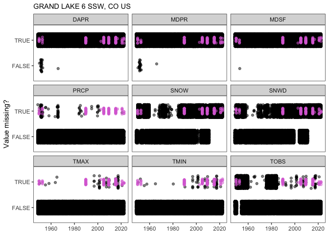

Prepare temperature data
================
CTW
2022-08-25

### Prepare temperature data

Test report to: 1. Read in NWT and neighbor station temperature datasets
2. Show raw data (removing any infilled or flagged data that we wish to
ignore for processing) 3. Show datasets prepared for QC procedure

All code will be displayed to show procedure and work out bugs

``` r
# -- SETUP -----
# libraries needed
library(tidyverse)
```

    ## ── Attaching packages ─────────────────────────────────────── tidyverse 1.3.1 ──

    ## ✔ ggplot2 3.3.6     ✔ purrr   0.3.4
    ## ✔ tibble  3.1.7     ✔ dplyr   1.0.9
    ## ✔ tidyr   1.2.0     ✔ stringr 1.4.0
    ## ✔ readr   2.1.2     ✔ forcats 0.5.1

    ## ── Conflicts ────────────────────────────────────────── tidyverse_conflicts() ──
    ## ✖ dplyr::filter() masks stats::filter()
    ## ✖ dplyr::lag()    masks stats::lag()

``` r
library(lubridate)
```

    ## 
    ## Attaching package: 'lubridate'

    ## The following objects are masked from 'package:base':
    ## 
    ##     date, intersect, setdiff, union

``` r
# source scripts (this will change for package)
source("~/github/nwt-data-munging/nwt_climate/R/fetch_data_functions.R")
source("~/github/nwt-data-munging/nwt_climate/R/prep_data_functions.R")
source("~/github/nwt-data-munging/nwt_climate/R/dataviz_functions.R")
source("~/github/nwt-data-munging/nwt_climate/R/common_qaqc_functions.R")

# specify path to data directory (can be wherever, but raw input files should live in data/raw)
datpath <- "~/Documents/nwt_lter/nwt_climate/data/"
fluxpath <- "~/Documents/nwt_lter/nwt_climate/data/raw/AmeriFlux"
ghcndpath <- "~/Documents/nwt_lter/nwt_climate/data/raw/GHCNd"

# create subfolders for data out if they don't exist
for(i in c("prep", "qc", "infill", "homogenize")){
  if(!i %in% list.files(datpath)){
    dir.create(paste0(datpath, i))
  }
  rm(i) # clean up environment
}

# other way to write
sapply(list("qc", "infill", "homogenize"), function(x) 
  if(!x %in% list.files(datpath)){
    dir.create(paste0(datpath, x))
  }
)
```

    ## [[1]]
    ## NULL
    ## 
    ## [[2]]
    ## NULL
    ## 
    ## [[3]]
    ## NULL

``` r
# read in dynamic datasets
snotel <- getSnotelNeighbors()
nwtchart <- getNWTcharts()
```

    ## Rows: 25294 Columns: 8

    ## ── Column specification ────────────────────────────────────────────────────────
    ## Delimiter: ","
    ## chr  (2): LTER_site, local_site
    ## dbl  (5): airtemp_max, flag_airtemp_max, airtemp_min, flag_airtemp_min, airt...
    ## date (1): date
    ## 
    ## ℹ Use `spec()` to retrieve the full column specification for this data.
    ## ℹ Specify the column types or set `show_col_types = FALSE` to quiet this message.

    ## [1] "Reading in knb-lter-nwt.411.14"

    ## Rows: 13325 Columns: 8
    ## ── Column specification ────────────────────────────────────────────────────────
    ## Delimiter: ","
    ## chr  (2): LTER_site, local_site
    ## dbl  (5): airtemp_max, flag_airtemp_max, airtemp_min, flag_airtemp_min, airt...
    ## date (1): date
    ## 
    ## ℹ Use `spec()` to retrieve the full column specification for this data.
    ## ℹ Specify the column types or set `show_col_types = FALSE` to quiet this message.

    ## [1] "Reading in knb-lter-nwt.413.11"

    ## Rows: 25294 Columns: 8
    ## ── Column specification ────────────────────────────────────────────────────────
    ## Delimiter: ","
    ## chr  (4): LTER_site, local_site, flag_airtemp_max, flag_airtemp_min
    ## dbl  (3): airtemp_max, airtemp_min, airtemp_avg
    ## date (1): date
    ## 
    ## ℹ Use `spec()` to retrieve the full column specification for this data.
    ## ℹ Specify the column types or set `show_col_types = FALSE` to quiet this message.

    ## [1] "Reading in knb-lter-nwt.412.12"

    ## Rows: 24929 Columns: 6
    ## ── Column specification ────────────────────────────────────────────────────────
    ## Delimiter: ","
    ## chr  (2): LTER_site, local_site
    ## dbl  (3): ppt_tot, qdays, flag_ppt_tot
    ## date (1): date
    ## 
    ## ℹ Use `spec()` to retrieve the full column specification for this data.
    ## ℹ Specify the column types or set `show_col_types = FALSE` to quiet this message.

    ## [1] "Reading in knb-lter-nwt.414.13"

    ## Rows: 14764 Columns: 6
    ## ── Column specification ────────────────────────────────────────────────────────
    ## Delimiter: ","
    ## chr  (3): LTER_site, local_site, flag_ppt_tot
    ## dbl  (2): ppt_tot, qdays
    ## date (1): date
    ## 
    ## ℹ Use `spec()` to retrieve the full column specification for this data.
    ## ℹ Specify the column types or set `show_col_types = FALSE` to quiet this message.

    ## [1] "Reading in knb-lter-nwt.416.12"

    ## Rows: 20911 Columns: 6
    ## ── Column specification ────────────────────────────────────────────────────────
    ## Delimiter: ","
    ## chr  (3): LTER_site, local_site, flag_ppt_tot
    ## dbl  (2): ppt_tot, qdays
    ## date (1): date
    ## 
    ## ℹ Use `spec()` to retrieve the full column specification for this data.
    ## ℹ Specify the column types or set `show_col_types = FALSE` to quiet this message.

    ## [1] "Reading in knb-lter-nwt.415.15"

``` r
nwtchart_infilled <- getNWTchartsinfilled()
```

    ## Rows: 24472 Columns: 25
    ## ── Column specification ────────────────────────────────────────────────────────
    ## Delimiter: ","
    ## chr  (11): LTER_site, local_site, flag_1, flag_2, flag_3, source_station, t_...
    ## dbl  (13): year, max_temp, min_temp, mean_temp, DTR, t_mean_pvalue, t_mean_r...
    ## date  (1): date
    ## 
    ## ℹ Use `spec()` to retrieve the full column specification for this data.
    ## ℹ Specify the column types or set `show_col_types = FALSE` to quiet this message.

    ## [1] "Reading in knb-lter-nwt.185.2"

    ## Rows: 24472 Columns: 25
    ## ── Column specification ────────────────────────────────────────────────────────
    ## Delimiter: ","
    ## chr  (11): LTER_site, local_site, flag_1, flag_2, flag_3, source_station, t_...
    ## dbl  (13): year, max_temp, min_temp, mean_temp, DTR, t_mean_pvalue, t_mean_r...
    ## date  (1): date
    ## 
    ## ℹ Use `spec()` to retrieve the full column specification for this data.
    ## ℹ Specify the column types or set `show_col_types = FALSE` to quiet this message.

    ## [1] "Reading in knb-lter-nwt.187.2"

    ## Rows: 25203 Columns: 14
    ## ── Column specification ────────────────────────────────────────────────────────
    ## Delimiter: ","
    ## chr  (6): LTER_site, local_site, flag_1, flag_2, source_station, regression_...
    ## dbl  (7): year, precip, pvalue, rsquared, num_obs_in_regression_equation, ra...
    ## date (1): date
    ## 
    ## ℹ Use `spec()` to retrieve the full column specification for this data.
    ## ℹ Specify the column types or set `show_col_types = FALSE` to quiet this message.

    ## [1] "Reading in knb-lter-nwt.184.5"

    ## Rows: 25203 Columns: 14
    ## ── Column specification ────────────────────────────────────────────────────────
    ## Delimiter: ","
    ## chr  (6): LTER_site, local_site, flag_1, flag_2, source_station, regression_...
    ## dbl  (7): year, precip, pvalue, rsquared, num_obs_in_regression_equation, ra...
    ## date (1): date
    ## 
    ## ℹ Use `spec()` to retrieve the full column specification for this data.
    ## ℹ Specify the column types or set `show_col_types = FALSE` to quiet this message.

    ## [1] "Reading in knb-lter-nwt.186.3"

``` r
nwtlogger <- getNWTdailyloggers()
```

    ## Rows: 4993 Columns: 31
    ## ── Column specification ────────────────────────────────────────────────────────
    ## Delimiter: ","
    ## chr   (9): logger, time_airtemp_max, time_airtemp_min, time_rh_max, time_rh_...
    ## dbl  (21): year, jday, airtemp_max, airtemp_min, airtemp_avg, rh_max, rh_min...
    ## date  (1): date
    ## 
    ## ℹ Use `spec()` to retrieve the full column specification for this data.
    ## ℹ Specify the column types or set `show_col_types = FALSE` to quiet this message.

    ## [1] "Reading in knb-lter-nwt.400.4"

    ## Rows: 4953 Columns: 28
    ## ── Column specification ────────────────────────────────────────────────────────
    ## Delimiter: ","
    ## chr   (8): logger, time_airtemp_max, time_airtemp_min, time_rh_max, time_rh_...
    ## dbl  (19): year, jday, airtemp_max, airtemp_min, airtemp_avg, rh_max, rh_min...
    ## date  (1): date
    ## 
    ## ℹ Use `spec()` to retrieve the full column specification for this data.
    ## ℹ Specify the column types or set `show_col_types = FALSE` to quiet this message.

    ## [1] "Reading in knb-lter-nwt.78.3"

    ## Rows: 5008 Columns: 28
    ## ── Column specification ────────────────────────────────────────────────────────
    ## Delimiter: ","
    ## chr   (1): logger
    ## dbl  (26): year, jday, airtemp_max, time_airtemp_max, airtemp_min, time_airt...
    ## date  (1): date
    ## 
    ## ℹ Use `spec()` to retrieve the full column specification for this data.
    ## ℹ Specify the column types or set `show_col_types = FALSE` to quiet this message.

    ## [1] "Reading in knb-lter-nwt.70.3"

    ## Rows: 7861 Columns: 102
    ## ── Column specification ────────────────────────────────────────────────────────
    ## Delimiter: ","
    ## chr  (51): LTER_site, local_site, logger, flag_airtemp_max, flag_airtemp_min...
    ## dbl  (50): year, jday, airtemp_max, airtemp_min, airtemp_avg, rh_max, rh_min...
    ## date  (1): date
    ## 
    ## ℹ Use `spec()` to retrieve the full column specification for this data.
    ## ℹ Specify the column types or set `show_col_types = FALSE` to quiet this message.

    ## [1] "Reading in knb-lter-nwt.401.7"

    ## Rows: 7861 Columns: 80
    ## ── Column specification ────────────────────────────────────────────────────────
    ## Delimiter: ","
    ## chr  (40): LTER_site, local_site, logger, flag_airtemp_max, flag_airtemp_min...
    ## dbl  (39): year, jday, airtemp_max, airtemp_min, airtemp_avg, rh_max, rh_min...
    ## date  (1): date
    ## 
    ## ℹ Use `spec()` to retrieve the full column specification for this data.
    ## ℹ Specify the column types or set `show_col_types = FALSE` to quiet this message.

    ## [1] "Reading in knb-lter-nwt.405.6"

    ## Rows: 7850 Columns: 76
    ## ── Column specification ────────────────────────────────────────────────────────
    ## Delimiter: ","
    ## chr  (38): LTER_site, local_site, logger, flag_airtemp_max, flag_airtemp_min...
    ## dbl  (37): year, jday, airtemp_max, airtemp_min, airtemp_avg, rh_max, rh_min...
    ## date  (1): date
    ## 
    ## ℹ Use `spec()` to retrieve the full column specification for this data.
    ## ℹ Specify the column types or set `show_col_types = FALSE` to quiet this message.

    ## [1] "Reading in knb-lter-nwt.402.5"

    ## Rows: 7993 Columns: 62
    ## ── Column specification ────────────────────────────────────────────────────────
    ## Delimiter: ","
    ## chr  (18): LTER_site, local_site, logger, flag_airtemp_max, flag_airtemp_min...
    ## dbl  (29): year, jday, airtemp_max, airtemp_min, airtemp_avg, rh_max, rh_min...
    ## date  (1): date
    ## time (14): time_airtemp_max, time_airtemp_min, time_rh_max, time_rh_min, tim...
    ## 
    ## ℹ Use `spec()` to retrieve the full column specification for this data.
    ## ℹ Specify the column types or set `show_col_types = FALSE` to quiet this message.

    ## [1] "Reading in knb-lter-nwt.148.1"

``` r
tvan <- getTabular(2) # J Knowles infilled tvan tower data, does not note which values were infilled but data complete for all timesteps, can perhaps determine infilled values using ameriflux tvan data
```

    ## Rows: 2557 Columns: 15
    ## ── Column specification ────────────────────────────────────────────────────────
    ## Delimiter: ","
    ## dbl  (14): year, jday, heat_flux_lat, heat_flux_sens, heat_flux_soil, solrad...
    ## date  (1): date
    ## 
    ## ℹ Use `spec()` to retrieve the full column specification for this data.
    ## ℹ Specify the column types or set `show_col_types = FALSE` to quiet this message.

    ## [1] "Reading in knb-lter-nwt.2.1"

``` r
# read in static/downloaded datasets 
ameriflux <- getAmeriflux(fluxpath)
ghcnd <- getGHCND(ghcndpath)
```

This workflow assumes the data user gave thought to choosing which data
stations to use for comparative data QC and infilling For example,
stations that have precedent (were used for previously infilling NWT
climate data in peer-reviewed publications) Or stations that may have
emerged or increased in quality since past infilling efforts This
workflow also assumes the data user is reading in as-is data and will
need to review each dataset to both get a basic understanding of what is
in the data and potential issues in each Every potential data source
(e.g., NWT, Snotel, Ameriflex, NOAA GHCNd, etc.) has their own data
structure, units, naming conventions, data QAQC (flagging may exist
fully, partially, or not at all), and metadata guidance It is up to the
data user to read documentation for each data source before starting the
workflow for responsible data use and to understand ramifications and
possible biases of using different datasets Because of the number of
sites involved and time/memory use constraints, it may make more sense
to separate data prep for each source into its own script/markdown We
should prep for all stations here for illustration.

``` r
# -- SCREEN AND SELECT DATA -----


# 1. NWT stations -----
```

Screen chart data (target infilling for basic issues, especially for
newer data to QC and infill), but ultimately will be appending newly
treated data to existing infilled dataset Also want to screen electronic
logger and other NWT climate data source (e.g., sensor array may become
an option with more time and data collected) While logger data are
available hourly, here we are only interested in daily logger data

``` r
# 1.1. NWT climate daily chart -----
# plot_all_list will plot all stations/data frames in list object
plot_all_list(listobject = nwtchart, timecol = "date", mets = c("airtemp", "ppt")) # default is to plot which timesteps have missing data
```

<!-- --><!-- --><!-- --><!-- --><!-- --><!-- -->

``` r
# > note: temp datasets were infilled for earlier periods by older methods, which is why missing data only occur for most recent decade+

# setting plotNA = F will plot the numeric data
plot_all_list(listobject = nwtchart, timecol = "date", mets = c("airtemp", "ppt"), plotNA = F)
```

<!-- --><!-- --><!-- --><!-- --><!-- --><!-- -->

Potential drift in SDL tmin data (noticeable upward trend not present in
max – avg is calculated from min/max) Increase in daily ppt overtime for
Saddle not present at C1 or D1 also noticeable

``` r
# for illustration, the infilled chart data
# > show actual values because no missing data present in infilled dataset
plot_all_list(listobject = nwtchart_infilled, timecol = "date", mets = c("m.*_temp", "precip", "DTR"), plotNA = F)
```

<!-- --><!-- --><!-- --><!-- -->

``` r
# nothing to do here for prep but to stack all datasets
chartTemp_out <-lapply(nwtchart[1:3], tidytemp)
```

    ## Note: Using an external vector in selections is ambiguous.
    ## ℹ Use `all_of(temp_pos)` instead of `temp_pos` to silence this message.
    ## ℹ See <https://tidyselect.r-lib.org/reference/faq-external-vector.html>.
    ## This message is displayed once per session.
    ## Joining, by = c("LTER_site", "local_site", "date", "yr", "mon", "doy", "met")
    ## Joining, by = c("LTER_site", "local_site", "date", "yr", "mon", "doy", "met")
    ## Joining, by = c("LTER_site", "local_site", "date", "yr", "mon", "doy", "met")

``` r
chartTemp_out <- data.table::rbindlist(chartTemp_out) %>%
  data.frame()
chartTemp_out <- check_datetime(chartTemp_out, groupvar = c("local_site"))
```

    ## [1] "date range for c1 is:"
    ## [1] "1952-10-01" "2021-12-31"
    ## [1] "0 missing time intervals corrected"
    ## [1] "date range for sdl is:"
    ## [1] "1981-07-09" "2017-12-31"
    ## [1] "0 missing time intervals corrected"
    ## [1] "date range for d1 is:"
    ## [1] "1952-10-01" "2021-12-31"
    ## [1] "0 missing time intervals corrected"

``` r
# prep NWT chart ppt -- need to make sure flag cols are character
chartPPT_out <- nwtchart[grepl("ppt", names(nwtchart))]
chartPPT_out <- data.table::rbindlist(chartPPT_out) %>%
  data.frame()
chartPPT_out <- check_datetime(chartPPT_out, groupvar = c("local_site"))
```

    ## [1] "date range for c1 is:"
    ## [1] "1952-10-01" "2020-12-31"
    ## [1] "0 missing time intervals corrected"
    ## [1] "date range for sdl is:"
    ## [1] "1981-07-31" "2021-12-31"
    ## [1] "0 missing time intervals corrected"
    ## [1] "date range for d1 is:"
    ## [1] "1964-10-01" "2021-12-31"
    ## [1] "0 missing time intervals corrected"

``` r
# 1.2. NWT climate daily logger -----
plot_all_list(listobject = nwtlogger, timecol = "date", mets = c("airtemp", "ppt"))
```

<!-- --><!-- --><!-- --><!-- --><!-- --><!-- --><!-- -->

``` r
plot_all_list(listobject = nwtlogger, timecol = "date", mets = c("airtemp", "ppt"), plotNA = F)
```

<!-- --><!-- --><!-- --><!-- --><!-- --><!-- --><!-- -->

Here we see unrealistic values with D1 21x logger era for airtemp min,
max and avg, otherwise temps across loggers are generally in the range
of plausible but with noticeable spikes

``` r
lapply(nwtlogger, names)
```

    ## $C121x
    ##  [1] "logger"           "date"             "year"             "jday"            
    ##  [5] "airtemp_max"      "time_airtemp_max" "airtemp_min"      "time_airtemp_min"
    ##  [9] "airtemp_avg"      "rh_max"           "time_rh_max"      "rh_min"          
    ## [13] "time_rh_min"      "rh_avg"           "bp_max"           "time_bp_max"     
    ## [17] "bp_min"           "time_bp_min"      "bp_avg"           "ws_max"          
    ## [21] "ws_min"           "ws_scal_avg"      "ws_vect_avg"      "wd_avg"          
    ## [25] "wd_sdev"          "solrad_max"       "time_solrad_max"  "solrad_tot"      
    ## [29] "UVB_max"          "time_UVB_max"     "UVB_tot"         
    ## 
    ## $SDL21x
    ##  [1] "logger"           "date"             "year"             "jday"            
    ##  [5] "airtemp_max"      "time_airtemp_max" "airtemp_min"      "time_airtemp_min"
    ##  [9] "airtemp_avg"      "rh_max"           "time_rh_max"      "rh_min"          
    ## [13] "time_rh_min"      "rh_avg"           "bp_max"           "time_bp_max"     
    ## [17] "bp_min"           "time_bp_min"      "bp_avg"           "ws_max"          
    ## [21] "ws_min"           "ws_scal_avg"      "ws_vect_avg"      "wd_avg"          
    ## [25] "wd_sdev"          "solrad_max"       "time_solrad_max"  "solrad_tot"      
    ## 
    ## $D121x
    ##  [1] "logger"           "date"             "year"             "jday"            
    ##  [5] "airtemp_max"      "time_airtemp_max" "airtemp_min"      "time_airtemp_min"
    ##  [9] "airtemp_avg"      "rh_max"           "time_rh_max"      "rh_min"          
    ## [13] "time_rh_min"      "rh_avg"           "bp_max"           "time_bp_max"     
    ## [17] "bp_min"           "time_bp_min"      "bp_avg"           "ws_max"          
    ## [21] "ws_min"           "ws_scal_avg"      "ws_vect_avg"      "wd_avg"          
    ## [25] "wd_sdev"          "solrad_max"       "time_solrad_max"  "solrad_tot"      
    ## 
    ## $C123x
    ##   [1] "LTER_site"                    "local_site"                  
    ##   [3] "logger"                       "date"                        
    ##   [5] "year"                         "jday"                        
    ##   [7] "airtemp_max"                  "flag_airtemp_max"            
    ##   [9] "airtemp_min"                  "flag_airtemp_min"            
    ##  [11] "airtemp_avg"                  "flag_airtemp_avg"            
    ##  [13] "rh_max"                       "flag_rh_max"                 
    ##  [15] "rh_min"                       "flag_rh_min"                 
    ##  [17] "rh_avg"                       "flag_rh_avg"                 
    ##  [19] "bp_max"                       "flag_bp_max"                 
    ##  [21] "bp_min"                       "flag_bp_min"                 
    ##  [23] "bp_avg"                       "flag_bp_avg"                 
    ##  [25] "ws_max"                       "flag_ws_max"                 
    ##  [27] "ws_min"                       "flag_ws_min"                 
    ##  [29] "ws_avg"                       "flag_ws_avg"                 
    ##  [31] "wd"                           "flag_wd"                     
    ##  [33] "solrad_avg"                   "flag_solrad_avg"             
    ##  [35] "solrad_tot"                   "flag_solrad_tot"             
    ##  [37] "ppt_tot"                      "flag_ppt_tot"                
    ##  [39] "snowdepth_avg"                "flag_snowdepth_avg"          
    ##  [41] "soiltemp_5cm_max"             "flag_soiltemp_5cm_max"       
    ##  [43] "soiltemp_5cm_min"             "flag_soiltemp_5cm_min"       
    ##  [45] "soiltemp_5cm_avg"             "flag_soiltemp_5cm_avg"       
    ##  [47] "soilmoist_5cm_avg"            "flag_soilmoist_5cm_avg"      
    ##  [49] "soilmoistprof_10cm_avg"       "flag_soilmoistprof_10cm_avg" 
    ##  [51] "soilmoistprof_20cm_avg"       "flag_soilmoistprof_20cm_avg" 
    ##  [53] "soilmoistprof_30cm_avg"       "flag_soilmoistprof_30cm_avg" 
    ##  [55] "soilmoistprof_50cm_avg"       "flag_soilmoistprof_50cm_avg" 
    ##  [57] "soilmoistprof_70cm_avg"       "flag_soilmoistprof_70cm_avg" 
    ##  [59] "soilmoistprof_100cm_avg"      "flag_soilmoistprof_100cm_avg"
    ##  [61] "soilmoistprof_150cm_avg"      "flag_soilmoistprof_150cm_avg"
    ##  [63] "soilmoistprof_200cm_avg"      "flag_soilmoistprof_200cm_avg"
    ##  [65] "airtemp_hmp1_max"             "flag_airtemp_hmp1_max"       
    ##  [67] "airtemp_hmp1_min"             "flag_airtemp_hmp1_min"       
    ##  [69] "airtemp_hmp1_avg"             "flag_airtemp_hmp1_avg"       
    ##  [71] "airtemp_hmp2_max"             "flag_airtemp_hmp2_max"       
    ##  [73] "airtemp_hmp2_min"             "flag_airtemp_hmp2_min"       
    ##  [75] "airtemp_hmp2_avg"             "flag_airtemp_hmp2_avg"       
    ##  [77] "airtemp_hmp3_max"             "flag_airtemp_hmp3_max"       
    ##  [79] "airtemp_hmp3_min"             "flag_airtemp_hmp3_min"       
    ##  [81] "airtemp_hmp3_avg"             "flag_airtemp_hmp3_avg"       
    ##  [83] "rh_hmp1_max"                  "flag_rh_hmp1_max"            
    ##  [85] "rh_hmp1_min"                  "flag_rh_hmp1_min"            
    ##  [87] "rh_hmp1_avg"                  "flag_rh_hmp1_avg"            
    ##  [89] "rh_hmp2_max"                  "flag_rh_hmp2_max"            
    ##  [91] "rh_hmp2_min"                  "flag_rh_hmp2_min"            
    ##  [93] "rh_hmp2_avg"                  "flag_rh_hmp2_avg"            
    ##  [95] "rh_hmp3_max"                  "flag_rh_hmp3_max"            
    ##  [97] "rh_hmp3_min"                  "flag_rh_hmp3_min"            
    ##  [99] "rh_hmp3_avg"                  "flag_rh_hmp3_avg"            
    ## [101] "snowdepth_avgofmed"           "flag_snowdepth_avgofmed"     
    ## 
    ## $SDL23x
    ##  [1] "LTER_site"              "local_site"             "logger"                
    ##  [4] "date"                   "year"                   "jday"                  
    ##  [7] "airtemp_max"            "flag_airtemp_max"       "airtemp_min"           
    ## [10] "flag_airtemp_min"       "airtemp_avg"            "flag_airtemp_avg"      
    ## [13] "rh_max"                 "flag_rh_max"            "rh_min"                
    ## [16] "flag_rh_min"            "rh_avg"                 "flag_rh_avg"           
    ## [19] "bp_max"                 "flag_bp_max"            "bp_min"                
    ## [22] "flag_bp_min"            "bp_avg"                 "flag_bp_avg"           
    ## [25] "ws_max"                 "flag_ws_max"            "ws_min"                
    ## [28] "flag_ws_min"            "ws_avg"                 "flag_ws_avg"           
    ## [31] "wd"                     "flag_wd"                "solrad_avg"            
    ## [34] "flag_solrad_avg"        "solrad_tot"             "flag_solrad_tot"       
    ## [37] "soiltemp_5cm_max"       "flag_soiltemp_5cm_max"  "soiltemp_5cm_min"      
    ## [40] "flag_soiltemp_5cm_min"  "soiltemp_5cm_avg"       "flag_soiltemp_5cm_avg" 
    ## [43] "soilmoist_5cm_avg"      "flag_soilmoist_5cm_avg" "airtemp_hmp1_max"      
    ## [46] "flag_airtemp_hmp1_max"  "airtemp_hmp1_min"       "flag_airtemp_hmp1_min" 
    ## [49] "airtemp_hmp1_avg"       "flag_airtemp_hmp1_avg"  "airtemp_hmp2_max"      
    ## [52] "flag_airtemp_hmp2_max"  "airtemp_hmp2_min"       "flag_airtemp_hmp2_min" 
    ## [55] "airtemp_hmp2_avg"       "flag_airtemp_hmp2_avg"  "airtemp_hmp3_max"      
    ## [58] "flag_airtemp_hmp3_max"  "airtemp_hmp3_min"       "flag_airtemp_hmp3_min" 
    ## [61] "airtemp_hmp3_avg"       "flag_airtemp_hmp3_avg"  "rh_hmp1_max"           
    ## [64] "flag_rh_hmp1_max"       "rh_hmp1_min"            "flag_rh_hmp1_min"      
    ## [67] "rh_hmp1_avg"            "flag_rh_hmp1_avg"       "rh_hmp2_max"           
    ## [70] "flag_rh_hmp2_max"       "rh_hmp2_min"            "flag_rh_hmp2_min"      
    ## [73] "rh_hmp2_avg"            "flag_rh_hmp2_avg"       "rh_hmp3_max"           
    ## [76] "flag_rh_hmp3_max"       "rh_hmp3_min"            "flag_rh_hmp3_min"      
    ## [79] "rh_hmp3_avg"            "flag_rh_hmp3_avg"      
    ## 
    ## $D123x
    ##  [1] "LTER_site"              "local_site"             "logger"                
    ##  [4] "date"                   "year"                   "jday"                  
    ##  [7] "airtemp_max"            "flag_airtemp_max"       "airtemp_min"           
    ## [10] "flag_airtemp_min"       "airtemp_avg"            "flag_airtemp_avg"      
    ## [13] "rh_max"                 "flag_rh_max"            "rh_min"                
    ## [16] "flag_rh_min"            "rh_avg"                 "flag_rh_avg"           
    ## [19] "bp_max"                 "flag_bp_max"            "bp_min"                
    ## [22] "flag_bp_min"            "bp_avg"                 "flag_bp_avg"           
    ## [25] "ws_max"                 "flag_ws_max"            "ws_min"                
    ## [28] "flag_ws_min"            "ws_avg"                 "flag_ws_avg"           
    ## [31] "wd"                     "flag_wd"                "solrad_avg"            
    ## [34] "flag_solrad_avg"        "solrad_tot"             "flag_solrad_tot"       
    ## [37] "soiltemp_5cm_avg"       "flag_soiltemp_5cm_avg"  "soilmoist_5cm_avg"     
    ## [40] "flag_soilmoist_5cm_avg" "airtemp_hmp1_max"       "flag_airtemp_hmp1_max" 
    ## [43] "airtemp_hmp1_min"       "flag_airtemp_hmp1_min"  "airtemp_hmp1_avg"      
    ## [46] "flag_airtemp_hmp1_avg"  "airtemp_hmp2_max"       "flag_airtemp_hmp2_max" 
    ## [49] "airtemp_hmp2_min"       "flag_airtemp_hmp2_min"  "airtemp_hmp2_avg"      
    ## [52] "flag_airtemp_hmp2_avg"  "airtemp_hmp3_max"       "flag_airtemp_hmp3_max" 
    ## [55] "airtemp_hmp3_min"       "flag_airtemp_hmp3_min"  "airtemp_hmp3_avg"      
    ## [58] "flag_airtemp_hmp3_avg"  "rh_hmp1_max"            "flag_rh_hmp1_max"      
    ## [61] "rh_hmp1_min"            "flag_rh_hmp1_min"       "rh_hmp1_avg"           
    ## [64] "flag_rh_hmp1_avg"       "rh_hmp2_max"            "flag_rh_hmp2_max"      
    ## [67] "rh_hmp2_min"            "flag_rh_hmp2_min"       "rh_hmp2_avg"           
    ## [70] "flag_rh_hmp2_avg"       "rh_hmp3_max"            "flag_rh_hmp3_max"      
    ## [73] "rh_hmp3_min"            "flag_rh_hmp3_min"       "rh_hmp3_avg"           
    ## [76] "flag_rh_hmp3_avg"      
    ## 
    ## $GL4
    ##  [1] "LTER_site"             "local_site"            "logger"               
    ##  [4] "date"                  "year"                  "jday"                 
    ##  [7] "airtemp_max"           "time_airtemp_max"      "flag_airtemp_max"     
    ## [10] "airtemp_min"           "time_airtemp_min"      "flag_airtemp_min"     
    ## [13] "airtemp_avg"           "flag_airtemp_avg"      "rh_max"               
    ## [16] "time_rh_max"           "flag_rh_max"           "rh_min"               
    ## [19] "time_rh_min"           "flag_rh_min"           "rh_avg"               
    ## [22] "flag_rh_avg"           "ws_max"                "time_ws_max"          
    ## [25] "flag_ws_max"           "ws_min"                "time_ws_min"          
    ## [28] "flag_ws_min"           "ws_avg"                "flag_ws_avg"          
    ## [31] "ws_scal"               "ws_vect"               "wd_avg"               
    ## [34] "flag_wd"               "wd_sdev"               "shortrad_max"         
    ## [37] "time_shortrad_max"     "shortrad_min"          "time_shortrad_min"    
    ## [40] "shortrad_avg"          "netrad_max"            "time_netrad_max"      
    ## [43] "flag_netrad_max"       "netrad_min"            "time_netrad_min"      
    ## [46] "flag_netrad_min"       "netrad_avg"            "flag_netrad_avg"      
    ## [49] "netradcorr_max"        "time_netradcorr_max"   "netradcorr_min"       
    ## [52] "time_netradcorr_min"   "netradcorr_avg"        "solrad_avg"           
    ## [55] "flag_solrad_avg"       "solrad_tot"            "flag_solrad_tot"      
    ## [58] "soilheatflux_max"      "time_soilheatflux_max" "soilheatflux_min"     
    ## [61] "time_soilheatflux_min" "soilheatflux_avg"

``` r
loggerTemp_out <- lapply(nwtlogger, function(x) subset.data.frame(x, select = grep("site|logger|date|^airtemp|^flag_airtemp", names(x), ignore.case = T)))
loggerTemp_out <- lapply(loggerTemp_out, tidytemp)
```

    ## Joining, by = c("logger", "date", "yr", "mon", "doy", "met")

    ## [1] "cr21x"
    ## [1] "1988-01-15"
    ## [1] "2000-06-28"

    ## Joining, by = c("logger", "date", "yr", "mon", "doy", "met")

    ## [1] "cr21x"
    ## [1] "1986-12-06"
    ## [1] "2000-06-27"

    ## Joining, by = c("logger", "date", "yr", "mon", "doy", "met")

    ## [1] "cr21x"
    ## [1] "1986-10-13"
    ## [1] "2000-05-08"

    ## Joining, by = c("LTER_site", "local_site", "logger", "date", "yr", "mon",
    ## "doy", "met")

    ## [1] "cr23x"
    ## [1] "2000-06-24"
    ## [1] "2013-03-24"
    ## [1] "cr1000"
    ## [1] "2013-03-27"
    ## [1] "2018-08-23"
    ## [1] "cr23x_hmp"
    ## [1] "2013-03-26"
    ## [1] "2000-06-24"
    ## [1] "cr1000_hmp"
    ## [1] "2017-01-01"
    ## [1] "2021-12-30"

    ## Joining, by = c("LTER_site", "local_site", "logger", "date", "yr", "mon",
    ## "doy", "met")

    ## [1] "cr23x"
    ## [1] "2000-06-24"
    ## [1] "2012-12-03"
    ## [1] "cr1000"
    ## [1] "2012-12-05"
    ## [1] "2018-12-31"
    ## [1] "cr23x_hmp"
    ## [1] "2012-12-04"
    ## [1] "2000-06-24"
    ## [1] "cr1000_hmp"
    ## [1] "2018-01-01"
    ## [1] "2021-12-31"

    ## Joining, by = c("LTER_site", "local_site", "logger", "date", "yr", "mon",
    ## "doy", "met")

    ## [1] "cr23x"
    ## [1] "2000-07-05"
    ## [1] "2013-10-23"
    ## [1] "cr1000"
    ## [1] "2013-11-15"
    ## [1] "2019-03-25"
    ## [1] "cr23x_hmp"
    ## [1] "2013-11-14"
    ## [1] "2000-07-05"
    ## [1] "cr1000_hmp"
    ## [1] "2018-01-01"
    ## [1] "2021-12-31"

    ## Joining, by = c("LTER_site", "local_site", "logger", "date", "yr", "mon",
    ## "doy", "met")

    ## [1] "cr10"
    ## [1] "2008-08-21"
    ## [1] "2012-07-19"
    ## [1] "cr1000"
    ## [1] "2013-11-04"
    ## [1] "2017-07-17"
    ## [1] "cr850"
    ## [1] "2017-07-18"
    ## [1] "2019-02-05"

``` r
# cr21x logger datasets don't have local_site so append dat name to each dataset so know which data corresponds to what
loggerTemp_out <- addSource(loggerTemp_out)
# for(i in 1:length(loggerTemp_out)){
#   loggerTemp_out[[i]] <- cbind(datsource = names(loggerTemp_out)[i], data.frame(loggerTemp_out[[i]]))
# }

loggerTemp_out <- lapply(loggerTemp_out, check_datetime)
```

    ## [1] "date range is:"
    ## [1] "1988-01-15" "2000-06-28"
    ## [1] "0 missing time intervals corrected"
    ## [1] "date range is:"
    ## [1] "1986-12-06" "2000-06-27"
    ## [1] "0 missing time intervals corrected"
    ## [1] "date range is:"
    ## [1] "1986-10-13" "2000-05-08"
    ## [1] "0 missing time intervals corrected"
    ## [1] "date range is:"
    ## [1] "2000-06-24" "2021-12-30"
    ## [1] "0 missing time intervals corrected"
    ## [1] "date range is:"
    ## [1] "2000-06-24" "2021-12-31"
    ## [1] "0 missing time intervals corrected"
    ## [1] "date range is:"
    ## [1] "2000-07-05" "2021-12-31"
    ## [1] "0 missing time intervals corrected"
    ## [1] "date range is:"
    ## [1] "2008-08-21" "2019-02-05"
    ## [1] "0 missing time intervals corrected"

``` r
loggerTemp_out <- data.table::rbindlist(loggerTemp_out, fill = T) %>% data.frame()
# infill LTER site and local_site for any where missing
loggerTemp_out$LTER_site <- unique(loggerTemp_out$LTER_site[!is.na(loggerTemp_out$LTER_site)])
loggerTemp_out$local_site <- with(loggerTemp_out, ifelse(is.na(local_site), casefold(str_extract(datsource, "C1|D1|SDL")), local_site))
# drop datsource
loggerTemp_out <- subset(loggerTemp_out, select = -datsource)

c1loggerPPT_out <- nwtlogger[["C123x"]] %>%
  subset(select = grepl("site|logger|date|ppt", names(.))) %>%
  check_datetime()
```

    ## [1] "date range is:"
    ## [1] "2000-06-24" "2021-12-31"
    ## [1] "0 missing time intervals corrected"

``` r
# 1.3 Tvan infilled ----
# only 1 site present, choose all columns present for metrics to plot except date, year and jday
available_dataviz(tvan, timecol = "date", mets = names(tvan)[!grepl("date|ye|jda", names(tvan))], plotNA = F)
```

<!-- -->

``` r
# closer look at temp metrics
available_dataviz(tvan, timecol = "date", mets = "^[a-z]+_temp", allvars = T, plotNA = F) # seems reasonable
```

<!-- -->

``` r
# 2. Other sources -----
```

Other sources of data include: Ameriflux, Snotel, and GHCNd. As NEON
towers acquire more data that may be an option.

``` r
# 2.1. Ameriflux -----
```

There are 3 possible Ameriflux sites to draw from: US-NR1 (near C1),
US-NR3 (Tvan East), US-NR4 (Tvan west) US-NR1 has the longest record and
is the best curated (e.g., QAQC’d and gap-filled), but because Tvan near
Saddle worth reviewing

``` r
# prep function selects meteorological variables of interest, classes timestamps as POSIX, and pulls out dates and time separately from the timestamps
# because data read in to a list, apply function to each element in list
ameriflux_prepped <- lapply(ameriflux, prepAmeriflux)

# visualize data available (missing/present) and data as read in (look for oddities and outliers)
# because ameriflux data are sub-daily, plotting can take some time for stations that have fairly complete records for multiple variables
plot_all_list(listobject = ameriflux_prepped, timecol = "TIMESTAMP_START", mets = c("TA", "P"))
```

<!-- --><!-- --><!-- -->

For US-NR1 P_PI_F… and TA_PI_F.. will be most reliable. Reading the data
documentation you’d guess this anyway, but it’s good to visualize to
confirm. NR3 or NR4 could maybe be helpful for short window temperature
infilling. Let’s inspect the actual data.

``` r
plot_all_list(listobject = ameriflux_prepped, timecol = "TIMESTAMP_START", mets = c("TA", "P"), plotNA = F)
```

<!-- --><!-- --><!-- -->

perhaps keep each of three qc’d and gap-filled sensors for temp at
US-NR1 in case.. will probably be able to use sensor 1 fully (1,2,3 are
at different vertical heights) or could choose to homogenize the three
For sub-hourly data, the next step in prepping data for this workflow’s
QC is to aggregate sub-hourly to daily data, just for columns and sites
of interest

``` r
ameriflux_daily <- lapply(ameriflux_prepped, sub2daily)
```

    ## Loading required package: magrittr

    ## 
    ## Attaching package: 'magrittr'

    ## The following object is masked from 'package:purrr':
    ## 
    ##     set_names

    ## The following object is masked from 'package:tidyr':
    ## 
    ##     extract

From here, review daily data to see what you’d like to keep for QC and
possible use in infilling

``` r
# what is the breakdown of data coverage by site by metric?
for(i in 1:length(ameriflux_daily)){
  print(with(ameriflux_daily[[i]], lapply(split(tot, metric), function(x) table(is.na(x))/length(x))))
}
```

    ## $P_1_1_1
    ## 
    ##     FALSE      TRUE 
    ## 0.3593063 0.6406937 
    ## 
    ## $P_PI_F_1_1_1
    ## 
    ##      FALSE       TRUE 
    ## 0.98888617 0.01111383 
    ## 
    ## $TA_1_1_1
    ## 
    ##      FALSE       TRUE 
    ## 0.97997069 0.02002931 
    ## 
    ## $TA_1_2_1
    ## 
    ##      FALSE       TRUE 
    ## 0.96885686 0.03114314 
    ## 
    ## $TA_1_3_1
    ## 
    ##     FALSE      TRUE 
    ## 0.8131412 0.1868588 
    ## 
    ## $TA_PI_F_1_1_1
    ## 
    ##      FALSE       TRUE 
    ## 0.98888617 0.01111383 
    ## 
    ## $TA_PI_F_1_2_1
    ## 
    ##      FALSE       TRUE 
    ## 0.97374206 0.02625794 
    ## 
    ## $TA_PI_F_1_3_1
    ## 
    ##      FALSE       TRUE 
    ## 0.97203224 0.02796776 
    ## 
    ## $TA
    ## 
    ##     FALSE      TRUE 
    ## 0.5620731 0.4379269 
    ## 
    ## $TA
    ## 
    ##     FALSE      TRUE 
    ## 0.7277949 0.2722051

``` r
# Tvan sites don't have too much available data
plot_all_list(listobject = ameriflux_daily[2:3], timecol = "date_start", mets = c("max", "min", "avg"), plotNA = F)
```

<!-- --><!-- -->

``` r
plot_all_groups(ameriflux_daily[[1]], groupvars = "metric", timecol = "date_start", mets = c("max", "min", "avg", "tot"), plotNA = F) # sensor 1 seems the most stable for temp
```

    ## [1] "Processing P_1_1_1"

<!-- -->

    ## [1] "Processing P_PI_F_1_1_1"

<!-- -->

    ## [1] "Processing TA_1_1_1"

<!-- -->

    ## [1] "Processing TA_1_2_1"

<!-- -->

    ## [1] "Processing TA_1_3_1"

<!-- -->

    ## [1] "Processing TA_PI_F_1_1_1"

<!-- -->

    ## [1] "Processing TA_PI_F_1_2_1"

<!-- -->

    ## [1] "Processing TA_PI_F_1_3_1"

<!-- -->

``` r
# what is the difference between sensor 1 and 2 for infilled temp?
ggplot(subset(ameriflux_daily[[1]], grepl("TA_PI_F_1", metric)), aes(date_start, max)) +
  geom_hline(aes(yintercept = 0), lty = 2) +
  geom_line(aes(col = metric), alpha = 0.5) +
  facet_wrap(~(date(date_start) > as.Date("2010-01-01")) + metric, scales = "free") # sensor 1 tends to be warmer than other 2, but other two have more range 
```

    ## Warning: Removed 333 row(s) containing missing values (geom_path).

<!-- -->

``` r
# what is the difference between sensor 1 raw vs. infilled temp?
ggplot(subset(ameriflux_daily[[1]], grepl("TA_PI_F_1_2|TA_1_2", metric)), aes(date_start, max)) +
  geom_point(aes(col = metric), alpha = 0.5)
```

    ## Warning: Removed 470 rows containing missing values (geom_point).

<!-- -->

``` r
  #facet_wrap(~metric, nrow = 3)
  
# what is the difference between sensor 1 raw vs. infilled ppt?
ggplot(subset(ameriflux_daily[[1]], grepl("P_", metric)), aes(date_start, tot)) +
  geom_point(aes(col = metric), alpha = 0.5) +
  facet_wrap(~metric, nrow = 2)
```

    ## Warning: Removed 5337 rows containing missing values (geom_point).

<!-- -->

``` r
# not much choice here.. if decide to ppt, know most of it is infilled
  
# put all in one dataset then subset to what you want to keep
ameriflux_out <- tidyAmeriflux(ameriflux_daily)
```

    ## [1] "date range for US-NR1 is:"
    ## [1] "1998-11-01" "2021-04-01"
    ## [1] "0 missing time intervals corrected"
    ## [1] "date range for US-NR3 is:"
    ## [1] "2007-05-17" "2020-12-31"
    ## [1] "0 missing time intervals corrected"
    ## [1] "date range for US-NR4 is:"
    ## [1] "2007-08-29" "2021-01-01"
    ## [1] "0 missing time intervals corrected"

``` r
# check how many values were adjusted from raw
lapply(split(ameriflux_out$raw_adjusted, paste(ameriflux_out$station_name, ameriflux_out$metric)), summary)
```

    ## $`Niwot Ridge Alpine (T-Van East) airtemp_avg`
    ##    Mode   FALSE 
    ## logical    4875 
    ## 
    ## $`Niwot Ridge Alpine (T-Van East) airtemp_max`
    ##    Mode   FALSE 
    ## logical    4875 
    ## 
    ## $`Niwot Ridge Alpine (T-Van East) airtemp_min`
    ##    Mode   FALSE 
    ## logical    4875 
    ## 
    ## $`Niwot Ridge Alpine (T-Van West) airtemp_avg`
    ##    Mode   FALSE 
    ## logical    4978 
    ## 
    ## $`Niwot Ridge Alpine (T-Van West) airtemp_max`
    ##    Mode   FALSE 
    ## logical    4978 
    ## 
    ## $`Niwot Ridge Alpine (T-Van West) airtemp_min`
    ##    Mode   FALSE 
    ## logical    4978 
    ## 
    ## $`Niwot Ridge Forest (LTER NWT1) airtemp_avg`
    ##    Mode   FALSE    TRUE 
    ## logical   22696    1868 
    ## 
    ## $`Niwot Ridge Forest (LTER NWT1) airtemp_max`
    ##    Mode   FALSE    TRUE 
    ## logical   22839    1725 
    ## 
    ## $`Niwot Ridge Forest (LTER NWT1) airtemp_min`
    ##    Mode   FALSE    TRUE 
    ## logical   22873    1691 
    ## 
    ## $`Niwot Ridge Forest (LTER NWT1) ppt_tot`
    ##    Mode   FALSE    TRUE 
    ## logical    2935    5253

``` r
# NA's for Niwot Ridge Forest are from 2021 not being infilled yet; Tvan sites don't have a QC'd value

# for US-NR1, just keep sensor 1 (infilled and raw); at other stations only temp (TA) is available for metric
ameriflux_out <- subset(ameriflux_out, rep == "_1_1_1" | grepl("3|4", station_id))


# 2.3. Snotel -----
snotel$Date <- as.Date(snotel$Date) 
plot_all_groups(snotel[,!grepl("Flag", names(snotel))], timecol = "Date", mets = c("Pre.*", "Air.*"), 
                groupvars = "Station.Name", plotNA = F)
```

    ## [1] "Processing High Lonesome"

<!-- -->

    ## [1] "Processing Lake Eldora"

<!-- -->

    ## [1] "Processing Niwot"

<!-- -->

    ## [1] "Processing Sawtooth"

<!-- -->

    ## [1] "Processing University Camp"

<!-- -->

All of these sites seem helpful (keep), variable names need to be
standardized Snotel data include the precip increment, and the
snow-adjusted precip increment. We want to use snow-adjusted.
Snow-adjusted is “daily positive increment in precipitation accum. or
SWE, whichever is larger, as observed by SNOTEL instrumentation. This is
done to address known scenarios in underatch” (Kirk and Schmidilin 2016,
Defining Large Precipitation Events in the Upper Colorado River Basin
and Contributions to Lake Powell Inflow)

``` r
# show diff between precip increment and snow adjusted
ggplot(snotel, aes(Date, Precipitation.Increment..mm. - Precipitation.Increment...Snow.adj..mm.)) +
  geom_point() +
  #geom_abline(aes(slope = 1, intercept = 0), col = "red") +
  facet_wrap(~Station.Name, scales = "free")
```

    ## Warning: Removed 152 rows containing missing values (geom_point).

<!-- -->

``` r
#  standardize col names and write out as tidy RDA file
snotel_out <- check_datetime(dat = snotel, datecol = "Date",groupvar = "Station.Name", idcols = grepl("Stat|Elev|Lat|Long", names(snotel)))
```

    ## [1] "date range for High Lonesome is:"
    ## [1] "2013-09-06" "2022-05-31"
    ## [1] "0 missing time intervals corrected"
    ## [1] "date range for Lake Eldora is:"
    ## [1] "1978-10-01" "2022-08-24"
    ## [1] "0 missing time intervals corrected"
    ## [1] "date range for Niwot is:"
    ## [1] "1980-10-01" "2022-08-24"
    ## [1] "0 missing time intervals corrected"
    ## [1] "date range for Sawtooth is:"
    ## [1] "2014-09-24" "2022-08-24"
    ## [1] "0 missing time intervals corrected"
    ## [1] "date range for University Camp is:"
    ## [1] "1978-10-01" "2022-08-24"
    ## [1] "0 missing time intervals corrected"

``` r
# convert snotel station elevation from ft to meters
snotel_out$Elevation..ft. <- ft2m(snotel_out$Elevation..ft.)
snotel_out <- tidySnotel(snotel_out)


# 2.3 GHCNd -----
ghcndattr <- names(ghcnd)[grepl("ATTR", names(ghcnd))]
ghcndmets <- gsub("_A.*$", "", ghcndattr)
# pink points are dates not present in the dataset (missing data = date present, no value; date missing = no row for the date [date and value missing])
plot_all_groups(ghcnd, timecol = "DATE", mets = ghcndmets, groupvars = "NAME", allvars = F)
```

    ## [1] "Processing ALLENSPARK 3 NW, CO US"

<!-- -->

    ## [1] "Processing COAL CREEK CANYON, CO US"

<!-- -->

    ## [1] "Processing ALLENSPARK 2 SE, CO US"

<!-- -->

    ## [1] "Processing BOULDER 14 W, CO US"

<!-- -->

    ## [1] "Processing NEDERLAND 2 NNE, CO US"

<!-- -->

    ## [1] "Processing NEDERLAND 5 NNW, CO US"

<!-- -->

    ## [1] "Processing CARIBOU RANCH, CO US"

<!-- -->

    ## [1] "Processing ESTES PARK 3 SSE, CO US"

<!-- -->

    ## [1] "Processing GRAND LAKE 1 NW, CO US"

<!-- -->

    ## [1] "Processing WINTER PARK, CO US"

<!-- -->

    ## [1] "Processing ESTES PARK, CO US"

<!-- -->

    ## [1] "Processing FRASER, CO US"

<!-- -->

    ## [1] "Processing BERTHOUD PASS, CO US"

<!-- -->

    ## [1] "Processing GRAND LAKE 6 SSW, CO US"

<!-- -->

    ## [1] "Processing SILVER LAKE, CO US"

<!-- -->

``` r
# because some of these datasets are missing dates, you will see lines connecting gaps (because in the dataset row x and row y are sequential, even though they are not sequential dates)
plot_all_groups(ghcnd, timecol = "DATE", mets = ghcndmets, groupvars = "NAME", allvars = F, plotNA = F)
```

    ## [1] "Processing ALLENSPARK 3 NW, CO US"

<!-- -->

    ## [1] "Processing COAL CREEK CANYON, CO US"

<!-- -->

    ## [1] "Processing ALLENSPARK 2 SE, CO US"

<!-- -->

    ## [1] "Processing BOULDER 14 W, CO US"

<!-- -->

    ## [1] "Processing NEDERLAND 2 NNE, CO US"

<!-- -->

    ## [1] "Processing NEDERLAND 5 NNW, CO US"

<!-- -->

    ## [1] "Processing CARIBOU RANCH, CO US"

<!-- -->

    ## [1] "Processing ESTES PARK 3 SSE, CO US"

<!-- -->

    ## [1] "Processing GRAND LAKE 1 NW, CO US"

<!-- -->

    ## [1] "Processing WINTER PARK, CO US"

<!-- -->

    ## [1] "Processing ESTES PARK, CO US"

<!-- -->

    ## [1] "Processing FRASER, CO US"

<!-- -->

    ## [1] "Processing BERTHOUD PASS, CO US"

<!-- -->

    ## [1] "Processing GRAND LAKE 6 SSW, CO US"

<!-- -->

    ## [1] "Processing SILVER LAKE, CO US"

<!-- -->

``` r
# checking for missing dates in the dataset is part of the within-site QC process, and so we will table that correction for later
```

Of all sites shown, the following that seem worthwhile (coverage
overlapping target datasets) for considering are:

-   Allenspark 2 SE (some gaps in 1980s and 90s but could be otherwise
    helpful for infilling early Saddle)
-   Allenspark 3 NW (good coverage for precip and temp mid 1990s to mid
    2000s – if station didn’t change, would be interesting to eval
    Saddle precip relationship vs. here)
-   Boulder 14 W (good ppt and temp coverage mid 2000s to present – this
    is also one of NOAA’s higher quality climate stations)
-   Coal Creek (decent precip and temp coverage 1980s to early 2020)
-   Fraser (gap 1970s to 1980s, but otherwise goes through present day
    and pre-dates 1920 – this may mean site shift though)
-   Estes Park (coverage)
-   Estes Park 3 SSE (ppt and temp coverage 2000 - present)
-   Grand Lake 1 NW (ppt and temp coverage 1940s - present)
-   Grand Lake 6 SSW
-   Berthoud Pass (for late 1960s-1980s)
-   Nederland 2 NEE (temp and ppt coverage 1970s to late 1980s)
-   Winter Park (won’t be too helpful for temp infilling, but precip
    coverage is 1940s-present)

Sites to drop from further use:

-   Caribou Ranch (only goes to early 1970s – but if C1 and D1 ever
    needed to be re-evaluated during that time, good candidate)
-   Nederland 5 NEE (too short of a time-series)
-   Silver Lake (only helpful for infilling through 1950s, but one of
    the few comparative stations for early C1 and D1 infilling)

Of the measurement variables present, we’ll only keep TMAX, TMIN, PRCP,
and TOBS (time of observation, which can influence temp systematically
if it changes)

``` r
ghcnd_idcols <- names(ghcnd)[grepl("stat|name|lat|long|elev", names(ghcnd), ignore.case = T)]
ghcnd_out <- subset(ghcnd, !grepl("carib|nederland 5|silver", NAME, ignore.case = T), 
                    select = c(ghcnd_idcols, names(ghcnd)[grepl("tmin|tmax|prcp|tobs|date", names(ghcnd), ignore.case = T)]))
ghcnd_out <- check_datetime(ghcnd_out, datecol = "DATE", idcols = ghcnd_idcols, groupvar = "NAME")
```

    ## [1] "date range for ALLENSPARK 3 NW, CO US is:"
    ## [1] "1994-01-01" "2004-06-30"
    ## [1] "49 missing time intervals corrected"
    ## [1] "date range for COAL CREEK CANYON, CO US is:"
    ## [1] "1984-07-01" "2019-10-31"
    ## [1] "4 missing time intervals corrected"
    ## [1] "date range for ALLENSPARK 2 SE, CO US is:"
    ## [1] "1962-01-01" "1993-12-31"
    ## [1] "1681 missing time intervals corrected"
    ## [1] "date range for BOULDER 14 W, CO US is:"
    ## [1] "2003-09-28" "2022-07-01"
    ## [1] "16 missing time intervals corrected"
    ## [1] "date range for NEDERLAND 2 NNE, CO US is:"
    ## [1] "1970-04-13" "1988-05-31"
    ## [1] "47 missing time intervals corrected"
    ## [1] "date range for ESTES PARK 3 SSE, CO US is:"
    ## [1] "1998-06-17" "2021-01-15"
    ## [1] "0 missing time intervals corrected"
    ## [1] "date range for GRAND LAKE 1 NW, CO US is:"
    ## [1] "1907-10-01" "2022-07-01"
    ## [1] "7583 missing time intervals corrected"
    ## [1] "date range for WINTER PARK, CO US is:"
    ## [1] "1942-03-01" "2022-07-01"
    ## [1] "421 missing time intervals corrected"
    ## [1] "date range for ESTES PARK, CO US is:"
    ## [1] "1896-02-01" "2001-06-30"
    ## [1] "5400 missing time intervals corrected"
    ## [1] "date range for FRASER, CO US is:"
    ## [1] "1908-06-20" "2022-07-01"
    ## [1] "6467 missing time intervals corrected"
    ## [1] "date range for BERTHOUD PASS, CO US is:"
    ## [1] "1950-01-01" "1985-04-30"
    ## [1] "4903 missing time intervals corrected"
    ## [1] "date range for GRAND LAKE 6 SSW, CO US is:"
    ## [1] "1948-08-01" "2022-07-01"
    ## [1] "144 missing time intervals corrected"

``` r
# collapse variable columns in so tidy (metrics in one column, attributes in another, then break into 4 cols of flag types )
ghcnd_out <- tidyGHCND(ghcnd_out, mets = c("TMAX", "TMIN", "PRCP", "TOBS")) 
```

    ## Warning: Expected 4 pieces. Missing pieces filled with `NA` in 360676 rows
    ## [28429, 28430, 28431, 28432, 28433, 28434, 28435, 28436, 28437, 28438, 28439,
    ## 28440, 28441, 28442, 28443, 28444, 28445, 28446, 28447, 28448, ...].

``` r
# -- WRITE OUT ------
```

Now that we’ve reviewed datasets available, we want to separate temp
from ppt in each data source, and assign common names across all
datasets for simplicity We also want to make sure the data source is
present in each dataset Once prepped, write out each set separately for
QC. Some stations may have too many QC flags for infilling use, and so
that’s why we keep sources separate when writing out. Once QC is done
and comparative sets are prepared for infilling, then we can combine all
stations in one dataset. Names can be whatever the user prefers, as long
as they are consistent across datasets I prefer lower camelCase or
snake_case format, so that’s how I’ll prep dats out here:

``` r
# standardize stations cols in ghcnd, and make metric convention similar to NWT
names(ghcnd_out)[names(ghcnd_out) %in% c("station", "name")] <- c("station_id", "station_name")
ghcnd_out$metric[ghcnd_out$metric == "TMIN"] <- "airtemp_min"
ghcnd_out$metric[ghcnd_out$metric == "TMAX"] <- "airtemp_max"
ghcnd_out$metric[ghcnd_out$metric == "PRCP"] <- "ppt_tot"
# time of observation still present as TOBS in metric


# snotel colnames already taken care of by tidySnotel function, but metrics need standardization
snotel_out$metric <- gsub("Air.Temperature", "airtemp", snotel_out$metric)
snotel_out$metric <- gsub("Precipitation.Increment", "ppt_tot", snotel_out$metric)
snotel_out$metric <- gsub(".", "_", snotel_out$metric, fixed = T)
snotel_out$metric <- casefold(snotel_out$metric)
snotel_out$metric[grepl("airtemp", snotel_out$metric)] <- substr(snotel_out$metric[grepl("airtemp", snotel_out$metric)],1,11)
snotel_out$metric <- gsub("_ave", "_avg", snotel_out$metric)

# ameriflux colnames and metric conventions already taken care of by tidyAmeriflux function


# can write out as .csv or rdata because they are large
# NWT data
write.csv(chartTemp_out, paste0(datpath, "/prep/nwtchartTemp_prep.csv"), row.names = F) #15 MB
write.csv(chartPPT_out, paste0(datpath, "/prep/nwtchartPPT_prep.csv"), row.names = F) #15 MB
write.csv(loggerTemp_out, paste0(datpath, "/prep/nwtloggerTemp_prep.csv"), row.names = F) #15 MB
write.csv(c1loggerPPT_out, paste0(datpath, "/prep/c1loggerPPT_prep.csv"), row.names = F) #15 MB
saveRDS(chartTemp_out, paste0(datpath, "/prep/nwtchartTemp_prep.rds")) #15 MB
saveRDS(chartPPT_out, paste0(datpath, "/prep/nwtchartPPT_prep.rds")) #15 MB
saveRDS(loggerTemp_out, paste0(datpath, "/prep/nwtloggerTemp_prep.rds")) #15 MB
saveRDS(c1loggerPPT_out, paste0(datpath, "/prep/c1loggerPPT_prep.rds")) #15 MB

# other data
write.csv(ameriflux_out, paste0(datpath, "/prep/ameriflux_prep.csv"), row.names = F) #15 MB
write.csv(snotel_out, paste0(datpath, "/prep/snotel_prep.csv"), row.names = F) #28 MB
write.csv(ghcnd_out, paste0(datpath, "/prep/ghcnd_prep.csv"), row.names = F) #103 MB
saveRDS(ameriflux_out, paste0(datpath, "/prep/ameriflux_prep.rds"))
saveRDS(snotel_out, paste0(datpath, "/prep/snotel_prep.rds"))
saveRDS(ghcnd, paste0(datpath, "/prep/ghcnd_prep.rds"))
```
